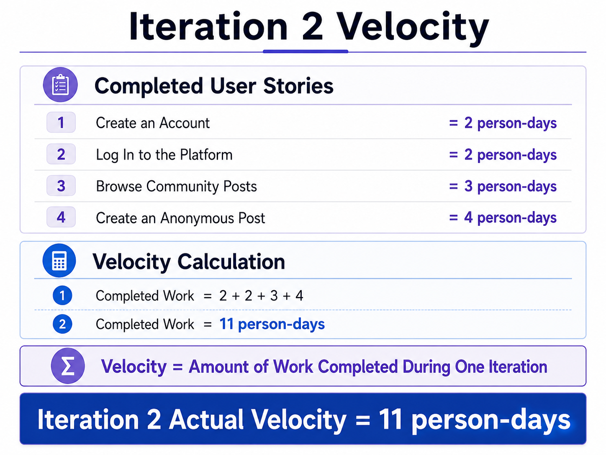
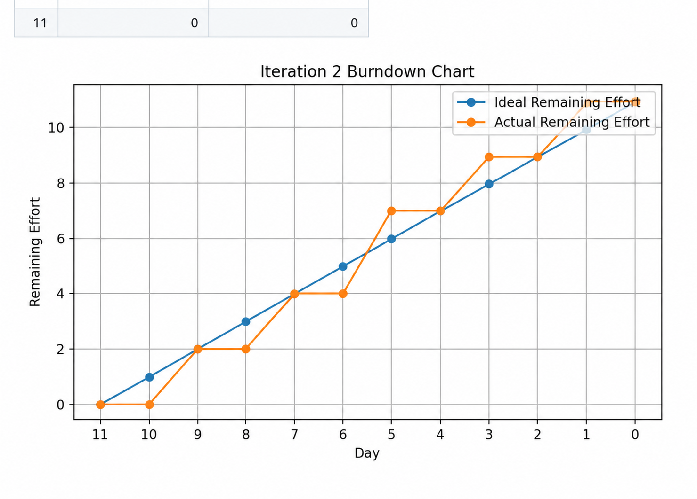

## Iteration 2

| User Story | Priority | Effort |
|------------|:--------:|:------:|
| Create an Account | 10 | 2 days |
| Log In to the Platform | 20 | 2 days |
| Browse Community Posts | 20 | 3 days |
| Create an Anonymous Post | 10 | 4 days |

**Total: 11 days**

## Iteration 2 Actual Velocity

The planned effort for Iteration 2 was 11 person-days.

The front-end prototypes for all four user stories were completed during the iteration.

The completed user stories were Create an Account, Log In to the Platform, Browse Community Posts, and Create an Anonymous Post.

However, account registration and login are not yet connected to a real authentication system. Anonymous posts are also not yet stored in a backend database.

Therefore, the completed front-end work represents an actual velocity of 11 person-days. Backend integration, database storage, and server-side validation remain unfinished work for a later iteration.

**Iteration 2 Actual Velocity: 11 person-days**

## Completed User Stories

The following front-end user stories were completed during Iteration 2:

- Create an Account
- Log In to the Platform
- Browse Community Posts
- Create an Anonymous Post

The user-interface pages and basic front-end interactions for these user stories were successfully implemented.

## Unfinished or Partially Completed Work

Although the front-end prototypes were completed, the following technical work remains unfinished:

- Connect account registration to a real authentication system
- Validate login credentials using backend logic
- Store user account information in the database
- Store anonymous posts in the database
- Add server-side form validation
- Complete frontend and backend integration
- Add automated tests
- Improve error handling for invalid input

These unfinished tasks will be considered in a later iteration.

## SRP Review

The team reviewed the project according to the Single Responsibility Principle.

The account registration page is mainly responsible for collecting new user account information.

The login page is mainly responsible for collecting user authentication information.

The community page is mainly responsible for displaying anonymous community posts.

The create-post page is mainly responsible for collecting and submitting anonymous post data.

The current page structure generally satisfies the Single Responsibility Principle because each page has one main purpose.

However, some JavaScript files currently include interface handling, form validation, and temporary data-management logic in the same file. These responsibilities should be separated into smaller modules in future development.

For example, form validation could be moved into a validation module, while data-management functions could be placed in a separate service or utility file.

## DRY Review

The team also reviewed the project according to the Don't Repeat Yourself principle.

Shared navigation elements and common CSS styles are reused across the website pages. This helps maintain a consistent interface and reduces repeated styling code.

However, some form-validation logic is repeated across the sign-up, login, and create-post pages.

The repeated validation code should be extracted into a shared JavaScript utility file.

Repeated headers, navigation menus, buttons, and form components could also be converted into reusable components.

Applying the DRY principle more consistently will make the project easier to maintain and reduce the risk of inconsistent behaviour between pages.

# Test-Driven Development

## Testing Objective

The objective of testing is to verify that the main Hello Dear functions satisfy their user-story acceptance criteria and correctly handle both valid and invalid input.

Testing will also help the team identify problems before new features are considered complete.

## Testing Scope

Testing will focus on the main functions developed during Iteration 2:

- Account registration
- User login
- Community post browsing
- Anonymous post creation
- Form validation
- Navigation between pages

## Testing Types

The project will use the following types of testing:

- Unit testing
- Form-validation testing
- User-interface testing
- Integration testing
- Automated testing

Unit testing will be used to test individual functions.

Form-validation testing will check whether invalid or incomplete information is correctly rejected.

User-interface testing will confirm that pages, buttons, forms, and navigation links work correctly.

Integration testing will be used after the frontend is connected to the backend and database.

Automated testing will be introduced to repeatedly check important functions and reduce manual testing effort.

## Current Testing Status

Basic manual testing was completed for the front-end pages during Iteration 2.

However, automated tests have not yet been fully implemented.

Automated testing will be added as part of the next development and testing activities.

## Iteration 2 Reflection

### What Went Well

- The main user-interface pages were completed successfully.
- The sign-up page was implemented.
- The login page was implemented.
- The community-post page was implemented.
- The anonymous post-creation page was implemented.
- Team members were able to divide tasks and work on different features.
- Shared CSS styles helped maintain a consistent visual design.
- The completed front-end work matched the planned effort of 11 person-days.

### What Could Be Improved

- Some features currently provide only front-end functionality.
- Account registration is not yet connected to a real authentication system.
- User login credentials are not yet validated through backend logic.
- User and post information is not yet stored in a database.
- More testing should have been completed during development.
- Automated tests were not fully implemented.
- Task progress and GitHub issue labels should have been updated more consistently.
- Some repeated validation code should be refactored into reusable functions.

### Improvements for Iteration 3

- Apply test-driven development before implementing new features.
- Write automated tests for the main user functions.
- Update GitHub issue labels regularly.
- Move tasks through Todo, In Progress, and Done during development.
- Connect the user interface to functional backend logic.
- Connect account registration and login to an authentication system.
- Store user and post data in the database.
- Add server-side validation and error handling.
- Refactor repeated JavaScript code into reusable modules.
- Use mock objects when testing user-related functions.
- Perform code reviews before merging major changes.
## Iteration 2 Burndown Data

| Day | Ideal Remaining Effort | Actual Remaining Effort |
|---:|---:|---:|
| 0 | 11 | 11 |
| 1 | 10 | 11 |
| 2 | 9 | 9 |
| 3 | 8 | 9 |
| 4 | 7 | 7 |
| 5 | 6 | 7 |
| 6 | 5 | 4 |
| 7 | 4 | 4 |
| 8 | 3 | 2 |
| 9 | 2 | 2 |
| 10 | 1 | 0 |
| 11 | 0 | 0 |

