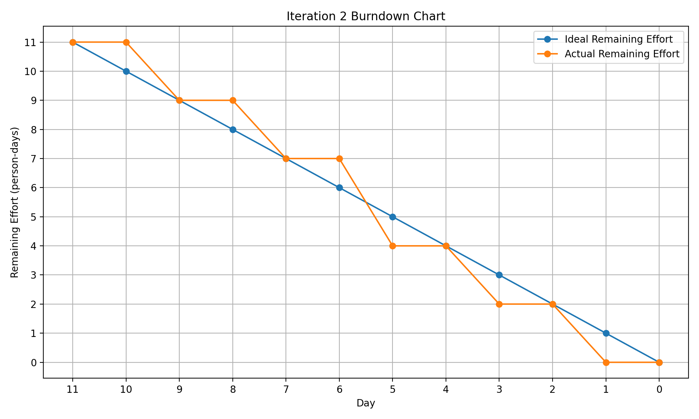
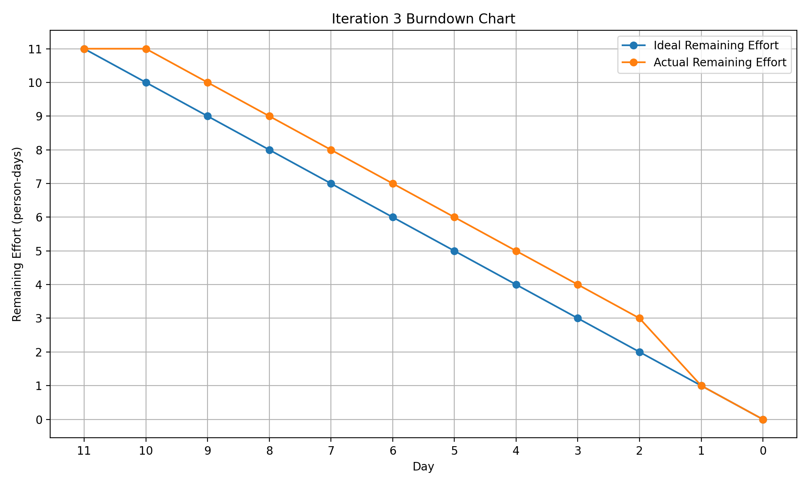

# Practical 8 – Iteration 3

## Objective

The objective of Iteration 3 is to complete the main backend functions of the Hello Dear Anonymous Student Support Platform and practise test-driven development.

The frontend pages and UI designs were completed during Iterations 1 and 2. Therefore, Iteration 3 focuses on connecting the existing interfaces to Java backend logic and a MySQL database.

The main goals of this iteration are:

- Implement administrator authentication and redirection.
- Protect the administrator dashboard through role-based access control.
- Connect the existing feedback form to backend services and MySQL.
- Display submitted feedback on the administrator dashboard.
- Use JUnit 5 and Mockito to test authentication logic without connecting to the real database.
- Monitor the work through GitHub Issues and the labels Todo, In Progress and Done.

---

# Iteration 2 Review

## Iteration 2 Backlog

| User Story | Priority | Effort |
|------------|:--------:|:------:|
| Create an Account | 10 | 2 person-days |
| Log In to the Platform | 20 | 2 person-days |
| Browse Community Posts | 20 | 3 person-days |
| Create an Anonymous Post | 10 | 4 person-days |

**Total Planned Effort: 11 person-days**

The frontend pages for all four user stories were completed during Iteration 2.

---

## Iteration 2 Actual Velocity

The completed work is calculated as follows:

- Create an Account = 2 person-days
- Log In to the Platform = 2 person-days
- Browse Community Posts = 3 person-days
- Create an Anonymous Post = 4 person-days

**Completed Work = 2 + 2 + 3 + 4**

**Completed Work = 11 person-days**

Velocity represents the amount of work completed during one iteration.

Therefore:

**Iteration 2 Actual Velocity = 11 person-days**

The completed work mainly covered the frontend implementation. Backend authentication, database storage, server-side validation and automated backend testing remained unfinished.

---

## Iteration 2 Burndown Data

| Day | Ideal Remaining Effort | Actual Remaining Effort |
|---:|---:|---:|
| 0 | 11 | 11 |
| 1 | 10 | 11 |
| 2 | 9 | 9 |
| 3 | 8 | 9 |
| 4 | 7 | 7 |
| 5 | 6 | 7 |
| 6 | 5 | 4 |
| 7 | 4 | 4 |
| 8 | 3 | 2 |
| 9 | 2 | 2 |
| 10 | 1 | 0 |
| 11 | 0 | 0 |

## Iteration 2 Burndown Chart



The chart shows that actual progress was slower than the ideal rate during several early days. The team completed more work during the later part of the iteration, and the remaining planned frontend work reached zero before the end of Day 11.

---

## Iteration 2 Reflection

### What Went Well

- The account registration page was completed.
- The login page was completed.
- The community posts page was completed.
- The anonymous post creation page was completed.
- Shared navigation and CSS styles created a consistent interface.
- Team members were able to divide the frontend work.
- The completed effort reached 11 person-days.

### What Could Be Improved

- Registration was not connected to a real authentication system.
- Login credentials were not validated through backend logic.
- User accounts were not stored in MySQL.
- Anonymous posts were not stored in MySQL.
- Some validation existed only in the browser.
- Automated backend tests were not completed.
- GitHub task labels were not always updated consistently.
- More pull requests and code reviews should have been completed.

### Improvements for Iteration 3

- Focus on backend development rather than creating additional frontend pages.
- Connect the existing frontend pages to Java controllers and services.
- Store application data in MySQL.
- Add server-side validation.
- Implement administrator authentication and role-based access control.
- Apply the Red–Green–Refactor TDD process.
- Use JUnit 5 for automated testing.
- Use Mockito to test login behaviour without the real database.
- Update GitHub Issues through Todo, In Progress and Done.

---

# Iteration 3 Backlog

The actual velocity of Iteration 2 was **11 person-days**. Therefore, the Iteration 3 backlog has been planned with the same total workload.

| User Story | Priority | Effort |
|------------|:--------:|:------:|
| Admin Login and Redirection | 10 | 3 person-days |
| Admin Dashboard | 10 | 3 person-days |
| Connect Feedback Form to Admin Dashboard | 20 | 3 person-days |
| Mock User Login Testing | 20 | 2 person-days |

**Planned Effort: 11 person-days**

**Iteration 2 Velocity: 11 person-days**

The Iteration 3 workload matches the team’s previous actual velocity and is therefore considered achievable.

---

# Iteration 3 User Stories

## User Story 1 – Admin Login and Redirection

### User Story

As an administrator,  
I want to log in using an administrator account,  
so that I can access the administrator dashboard.

### Acceptance Criteria

- The administrator can enter a username and password.
- The existing login page sends credentials to the backend.
- The backend validates the submitted credentials.
- Passwords are not stored as plain text.
- Valid administrator credentials create an authenticated session.
- A valid administrator is redirected to the administrator dashboard.
- Invalid credentials display an error message.
- Empty required fields prevent form submission.
- A normal user cannot access the administrator dashboard.
- An unauthenticated user is redirected to the administrator login page.

---

## User Story 2 – Admin Dashboard

### User Story

As an administrator,  
I want to access a protected administrator dashboard,  
so that I can review submitted feedback and manage platform information.

### Acceptance Criteria

- Only an authenticated administrator can access the dashboard.
- The backend checks the current user role.
- An unauthenticated user is redirected to the administrator login page.
- A normal user receives an access-denied response.
- The dashboard displays submitted feedback.
- The administrator can view each feedback message and submission time.
- The administrator can log out.
- Logging out invalidates the current session.

---

## User Story 3 – Connect Feedback Form to Admin Dashboard

### User Story

As an administrator,  
I want student feedback to be stored and displayed on the administrator dashboard,  
so that I can review suggestions and problems reported by platform users.

### Acceptance Criteria

- The existing feedback form sends data to a backend endpoint.
- Empty feedback cannot be submitted.
- Feedback that exceeds the permitted length is rejected.
- Valid feedback is stored in MySQL.
- Every feedback record contains an ID, message and submission time.
- Stored feedback is retrieved by the backend.
- Submitted feedback appears on the administrator dashboard.
- Only an authenticated administrator can retrieve all feedback.
- Database errors are handled without crashing the application.

---

## User Story 4 – Mock User Login Testing

### User Story

As a developer,  
I want to use mock user data when testing the login service,  
so that authentication logic can be tested without connecting to the real MySQL database.

### Acceptance Criteria

- A mock user repository can return a valid administrator account.
- A mock user repository can return a valid normal user account.
- A mock repository can simulate an unknown username.
- A mock repository can simulate an incorrect password.
- A mock repository can simulate a database exception.
- The AuthenticationService can be tested without MySQL.
- The tests verify that the repository is called correctly.
- All completed authentication tests pass.

---

# Task Breakdown

## User Story 1 – Admin Login and Redirection

| Task | Estimation | Initial Status |
|------|:----------:|----------------|
| Define User entity and user roles | 0.5 day | Todo |
| Create UserRepository and MySQL query | 0.5 day | Todo |
| Write administrator login tests | 0.5 day | Todo |
| Implement AuthenticationService | 0.5 day | Todo |
| Implement login controller and session handling | 0.5 day | Todo |
| Test login, redirection and access control | 0.5 day | Todo |

**Total: 3 person-days**

---

## User Story 2 – Admin Dashboard

| Task | Estimation | Initial Status |
|------|:----------:|----------------|
| Write administrator dashboard access tests | 0.5 day | Todo |
| Implement administrator role checking | 0.5 day | Todo |
| Implement AdminDashboardController | 0.5 day | Todo |
| Load dashboard data through backend services | 0.5 day | Todo |
| Implement logout and session invalidation | 0.5 day | Todo |
| Test authorised and unauthorised access | 0.5 day | Todo |

**Total: 3 person-days**

---

## User Story 3 – Connect Feedback Form to Admin Dashboard

| Task | Estimation | Initial Status |
|------|:----------:|----------------|
| Define Feedback entity and database table | 0.5 day | Todo |
| Create FeedbackRepository | 0.5 day | Todo |
| Write feedback validation and storage tests | 0.5 day | Todo |
| Implement FeedbackService | 0.5 day | Todo |
| Implement submission and retrieval controllers | 0.5 day | Todo |
| Connect the existing frontend form and dashboard to the backend | 0.5 day | Todo |

**Total: 3 person-days**

---

## User Story 4 – Mock User Login Testing

| Task | Estimation | Initial Status |
|------|:----------:|----------------|
| Research Mockito and mock object concepts | 0.5 day | Todo |
| Add JUnit 5 and Mockito dependencies | 0.5 day | Todo |
| Implement mocked login test scenarios | 0.5 day | Todo |
| Run tests and document test results | 0.5 day | Todo |

**Total: 2 person-days**

---

# GitHub Task Tracking

## Initial Iteration 3 Status

### Todo

- Admin Login and Redirection
- Admin Dashboard
- Connect Feedback Form to Admin Dashboard
- Mock User Login Testing

### In Progress

No Iteration 3 user stories are initially in progress.

### Done

No Iteration 3 user stories are initially complete.

## Required Labels

- `todo`
- `in-progress`
- `done`
- `iteration-3`
- `priority-10`
- `priority-20`
- `backend`
- `database`
- `testing`
- `mock-object`

Each user story should move through the following workflow:

**Todo → In Progress → Done**

A user story should only be marked as Done when:

- The backend implementation is complete.
- The acceptance criteria are satisfied.
- Automated tests pass.
- The related GitHub Issue is updated.
- The code is committed and reviewed.

---

# Backend Architecture

The backend should use a layered architecture.

```text
Existing Frontend Pages
          |
          v
      Controllers
          |
          v
       Services
          |
          v
     Repositories
          |
          v
    MySQL Database
```

## Main Backend Classes

### User

Suggested fields:

- `userId`
- `username`
- `passwordHash`
- `role`
- `accountStatus`

### Feedback

Suggested fields:

- `feedbackId`
- `message`
- `submittedAt`
- `status`

### UserRepository

Responsibilities:

- Find a user by username.
- Save a user account.
- Check whether a username already exists.

### FeedbackRepository

Responsibilities:

- Save submitted feedback.
- Retrieve all feedback.
- Retrieve feedback by ID.

### AuthenticationService

Responsibilities:

- Validate login credentials.
- Verify password information.
- Check the administrator role.
- Return an authentication result.

### FeedbackService

Responsibilities:

- Validate submitted feedback.
- Save valid feedback.
- Retrieve feedback for administrators.

### AdminController

Responsibilities:

- Process administrator login requests.
- Redirect authenticated administrators.
- Return dashboard information.
- Process logout requests.
- Reject unauthorised access.

---

# MySQL Database Design

## Users Table

```sql
CREATE TABLE users (
    user_id INT PRIMARY KEY AUTO_INCREMENT,
    username VARCHAR(100) NOT NULL UNIQUE,
    password_hash VARCHAR(255) NOT NULL,
    role VARCHAR(20) NOT NULL,
    account_status VARCHAR(20) NOT NULL DEFAULT 'ACTIVE'
);
```

## Feedback Table

```sql
CREATE TABLE feedback (
    feedback_id INT PRIMARY KEY AUTO_INCREMENT,
    message VARCHAR(1000) NOT NULL,
    submitted_at TIMESTAMP NOT NULL DEFAULT CURRENT_TIMESTAMP,
    status VARCHAR(20) NOT NULL DEFAULT 'NEW'
);
```

The table and column names may be adjusted to match the final backend implementation.

---

# Test-Driven Development

## TDD Objective

The purpose of TDD in Iteration 3 is to use the existing UI designs and user-story acceptance criteria as test specifications.

The team will follow the Red–Green–Refactor cycle.

## Red

- Select one acceptance criterion.
- Write an automated test for the expected backend behaviour.
- Run the test and confirm that it fails.

## Green

- Write the minimum backend code required to satisfy the test.
- Run the test again and confirm that it passes.

## Refactor

- Improve class and method names.
- Remove duplicated logic.
- Separate controller, service and repository responsibilities.
- Run all tests again after refactoring.

---

# Automated Test Specifications

## Admin Login Tests

### TC-I3-01 – Valid Administrator Login

A valid administrator username and password should return a successful authentication result.

### TC-I3-02 – Invalid Password

A valid administrator username with an incorrect password should return an authentication failure.

### TC-I3-03 – Unknown Username

A username that does not exist should return an authentication failure.

### TC-I3-04 – Normal User Role

A normal user account should not receive administrator access.

### TC-I3-05 – Empty Credentials

Empty login credentials should be rejected before accessing the database.

---

## Admin Dashboard Tests

### TC-I3-06 – Authenticated Administrator Access

An authenticated administrator should be able to retrieve the dashboard.

### TC-I3-07 – Unauthenticated Access

An unauthenticated request should be redirected to the administrator login page.

### TC-I3-08 – Normal User Access

A normal authenticated user should receive an access-denied response.

### TC-I3-09 – Administrator Logout

Logging out should invalidate the administrator session.

---

## Feedback Tests

### TC-I3-10 – Save Valid Feedback

Valid feedback should be stored successfully.

### TC-I3-11 – Reject Empty Feedback

An empty feedback message should not be stored.

### TC-I3-12 – Reject Long Feedback

Feedback longer than the permitted maximum should be rejected.

### TC-I3-13 – Retrieve Feedback

Stored feedback should be returned to an authenticated administrator.

### TC-I3-14 – Unauthorised Feedback Retrieval

A normal or unauthenticated user should not retrieve all feedback.

---

## Mock Login Tests

### TC-I3-15 – Mock Repository Returns Administrator

The mock repository returns a valid administrator and authentication succeeds.

### TC-I3-16 – Mock Repository Returns No User

The mock repository returns no matching user and authentication fails.

### TC-I3-17 – Mock Repository Simulates Incorrect Password

The mock repository returns a user, but password validation fails.

### TC-I3-18 – Mock Repository Throws Exception

A database exception simulated by the mock repository is handled correctly.

---

# Mock Object Framework Research

## What Is a Mock Object?

A mock object is a controlled replacement for a real dependency.

During login testing, AuthenticationService normally depends on UserRepository and MySQL. A mock UserRepository can replace the real database and return predefined results.

## Selected Framework

The project will use:

- JUnit 5
- Mockito

Mockito supports:

- `@Mock` to create mock dependencies.
- `@InjectMocks` to inject mocks into the class under test.
- `when(...).thenReturn(...)` to define mock behaviour.
- `verify(...)` to check repository interactions.

## Mock Login Structure

```text
JUnit Test
     |
     v
AuthenticationService
     |
     v
Mock UserRepository
     |
     v
Predefined User Result
```

## Example Mockito Test

```java
@ExtendWith(MockitoExtension.class)
class AuthenticationServiceTest {

    @Mock
    private UserRepository userRepository;

    @InjectMocks
    private AuthenticationService authenticationService;

    @Test
    void validAdministratorCredentialsShouldAuthenticate() {
        User administrator = new User(
            1,
            "admin",
            "stored-password-hash",
            "ADMIN",
            "ACTIVE"
        );

        when(userRepository.findByUsername("admin"))
            .thenReturn(Optional.of(administrator));

        AuthenticationResult result =
            authenticationService.authenticate(
                "admin",
                "admin123"
            );

        assertTrue(result.isAuthenticated());
        assertEquals("ADMIN", result.getRole());

        verify(userRepository).findByUsername("admin");
    }
}
```

The class names, constructors and methods must be adapted to the real project code.

---

# Iteration 3 Burndown

## Iteration 3 Burndown Data

The following values are a realistic initial tracking draft for the 11-person-day backend iteration. Replace the Actual Remaining Effort values with the team’s real daily data before final submission.

| Day | Ideal Remaining Effort | Actual Remaining Effort |
|---:|---:|---:|
| 0 | 11 | 11 |
| 1 | 10 | 11 |
| 2 | 9 | 10 |
| 3 | 8 | 9 |
| 4 | 7 | 8 |
| 5 | 6 | 7 |
| 6 | 5 | 6 |
| 7 | 4 | 5 |
| 8 | 3 | 4 |
| 9 | 2 | 3 |
| 10 | 1 | 1 |
| 11 | 0 | 0 |

## Iteration 3 Burndown Chart



The chart is used to monitor the remaining Iteration 3 backend work. If the actual line is above the ideal line, progress is slower than planned. If it is below the ideal line, progress is faster than planned.

---

# Recommended Commit History

Use the real GitHub commit history in the final report.

Recommended commit messages include:

```text
test: add administrator authentication tests
feat: create user entity and repository
feat: implement authentication service
feat: add administrator login controller
feat: protect administrator dashboard
test: add administrator access-control tests
feat: create feedback entity and repository
test: add feedback service tests
feat: connect feedback form to backend
feat: display feedback on administrator dashboard
test: add Mockito login tests
refactor: separate controller service and repository logic
docs: update iteration 3 report
```

---

# Pull Request

## Suggested Pull Request Title

```text
Implement Iteration 3 backend and administrator authentication
```

## Suggested Description

```text
This pull request implements the Iteration 3 backend work for
the Hello Dear Anonymous Student Support Platform.

Implemented features:

- Administrator authentication
- Administrator role validation
- Protected administrator dashboard
- Feedback storage in MySQL
- Feedback retrieval for administrators
- Server-side validation
- JUnit 5 automated tests
- Mockito login tests

All tests should pass before the pull request is merged.
```

---

# GitHub Pages and Backend Evidence

The frontend pages can continue to be displayed through GitHub Pages. Because Iteration 3 mainly contains backend work, the report must also include backend evidence.

## Admin Login Evidence

- Administrator login page screenshot
- AuthenticationService source-code path
- Login controller source-code path
- Successful login screenshot
- Invalid login screenshot
- Automated test result screenshot
- GitHub Issue link

## Admin Dashboard Evidence

- Administrator dashboard screenshot
- AdminDashboardController source-code path
- Role-checking code path
- Unauthorised-access test result
- Logout test result
- GitHub Issue link

## Feedback Evidence

- Feedback form screenshot
- FeedbackController source-code path
- FeedbackRepository source-code path
- MySQL feedback table screenshot
- Feedback displayed on the dashboard
- Feedback tests result
- GitHub Issue link

## Mock Object Evidence

- Mockito test file path
- Test execution screenshot
- GitHub Issue link
- Related commit or Pull Request link

---

# Completed and Unfinished Work

## Completed Before Iteration 3

- Home page and navigation
- About page
- Mental health resources page
- Account registration interface
- Login interface
- Community posts interface
- Anonymous post creation interface
- Administrator login interface
- Administrator dashboard interface
- Feedback form interface

## Backend Work Assigned to Iteration 3

- Administrator authentication
- Administrator role validation
- Session management
- Dashboard access control
- Feedback validation
- Feedback storage in MySQL
- Feedback retrieval
- Frontend and backend integration
- JUnit 5 testing
- Mockito login testing

Update this section at the end of the iteration to show which backend tasks were completed and which remain unfinished.

---

# Iteration 3 Reflection

## What Went Well

- The completed frontend interfaces were reused.
- Development focused on backend implementation.
- User stories and acceptance criteria were converted into tests.
- Backend responsibilities were separated into controllers, services and repositories.
- Mockito allowed authentication logic to be tested without MySQL.

Delete or modify any statement that does not match the final implementation.

## What Could Be Improved

- Record any unfinished backend functions.
- Record failed tests.
- Record database connection problems.
- Record GitHub tracking problems.
- Record code-review problems.

## Lessons Learned

- UI designs can be used as test specifications.
- Backend logic should be separated from frontend presentation.
- Mock objects support isolated testing.
- TDD can identify problems before integration.
- GitHub labels should be updated throughout the iteration.

---

# Iteration 3 Final Checklist

- [ ] Iteration 2 reflection is included.
- [ ] Iteration 2 Actual Velocity is calculated as 11 person-days.
- [ ] Iteration 2 Burndown Chart is included.
- [ ] Iteration 3 backlog totals 11 person-days.
- [ ] User stories have backend acceptance criteria.
- [ ] User stories are divided into backend tasks.
- [ ] Todo, In Progress and Done labels are used.
- [ ] Administrator authentication is implemented.
- [ ] Administrator dashboard access is protected.
- [ ] Feedback is stored in MySQL.
- [ ] Feedback is displayed on the administrator dashboard.
- [ ] Server-side validation is implemented.
- [ ] JUnit 5 automated tests are implemented.
- [ ] Mockito mock login tests are implemented.
- [ ] Iteration 3 Burndown Chart is updated with real progress.
- [ ] GitHub Pages and backend evidence are included.
- [ ] Meaningful commits are visible.
- [ ] Pull Request evidence is included.
- [ ] Completed and unfinished work is documented.
