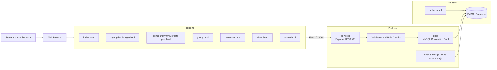
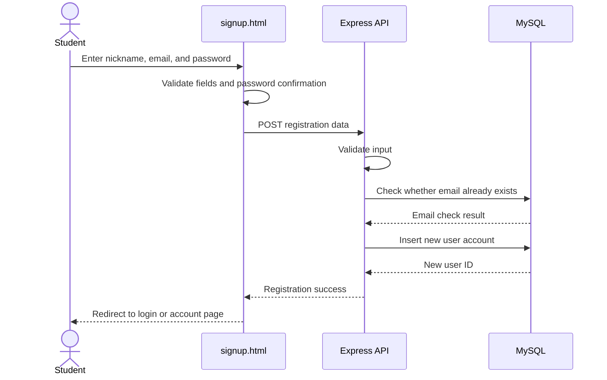
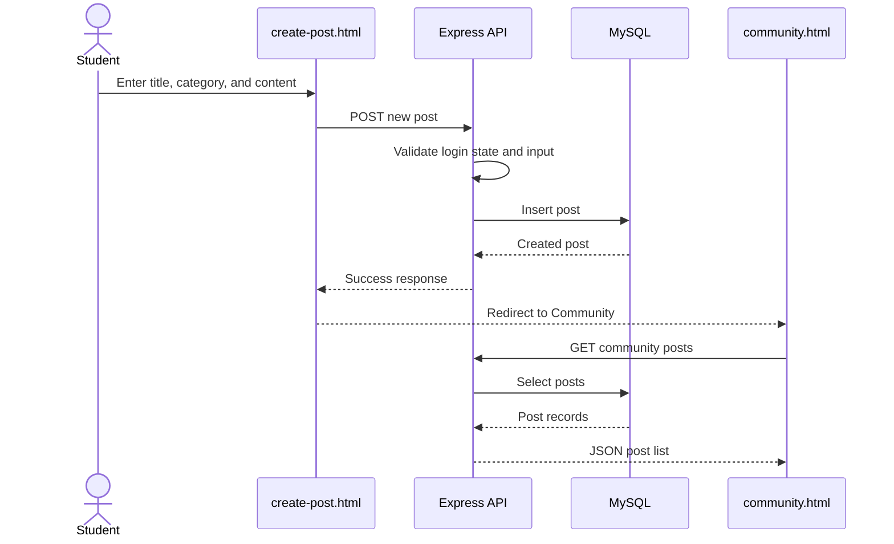
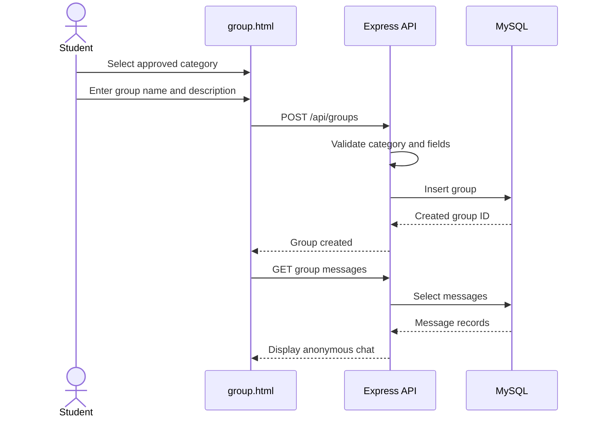
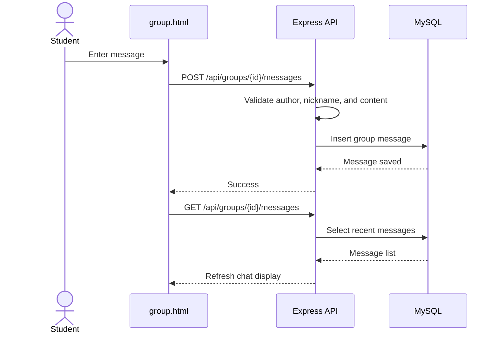
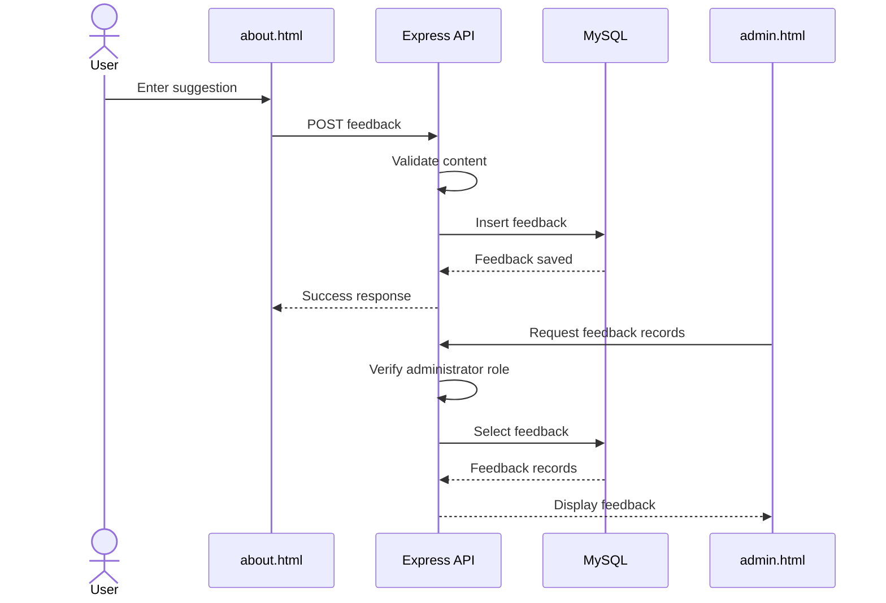
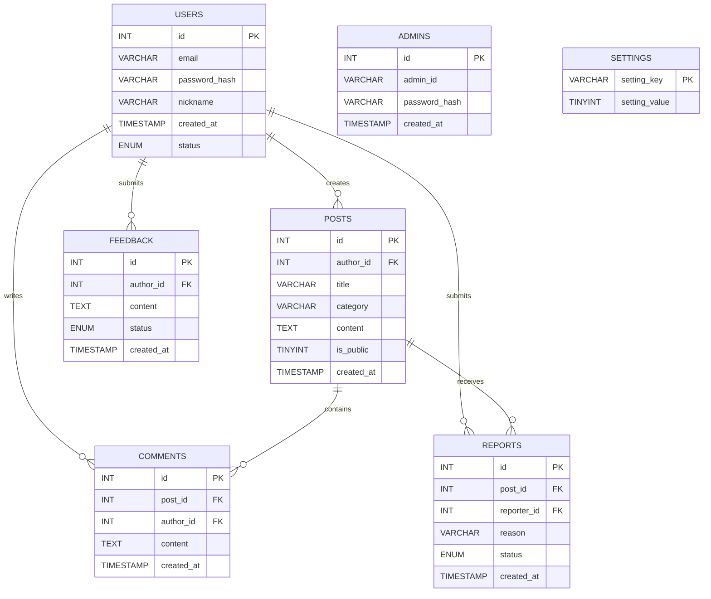
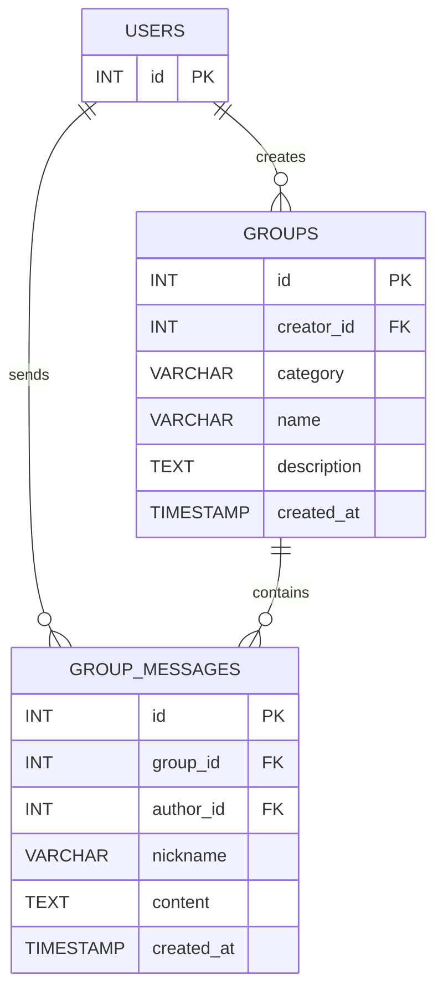

# Hello Dear – System Design

## 1. Purpose of This Page

This page explains the design of the major components of **Hello Dear**, a web-based anonymous peer-support platform for university students.

The system is designed to allow students to:

- create an anonymous account;
- log in securely;
- browse and publish anonymous community posts;
- comment on posts and mark helpful responses;
- report inappropriate content;
- create and join support groups;
- communicate in group chats using an anonymous nickname;
- browse university support resources;
- submit feedback; and
- allow authorised administrators to review platform information.

The design focuses on privacy, usability, maintainability, and a clear separation between the user interface, server logic, and database.

---

## 2. Design Goals

1. **Protect student identity** – public pages display an anonymous nickname rather than a real name or university email.
2. **Provide a simple user experience** – the interface uses consistent navigation, buttons, colours, spacing, forms, and feedback messages.
3. **Separate major responsibilities** – frontend pages handle presentation, the Node.js backend handles application logic, and MySQL stores persistent data.
4. **Support incremental development** – new components can be added without redesigning the complete application.
5. **Support moderation and administration** – administrator functions are separated from normal user functions.
6. **Maintain a realistic project scope** – the architecture is suitable for a three-person student development team.

---

## 3. Technology Stack

| Layer | Technology | Purpose |
|---|---|---|
| User Interface | HTML5 | Defines page structure and accessible content |
| Styling | CSS3 | Provides responsive layouts and consistent branding |
| Client Logic | JavaScript | Handles forms, API requests, filtering, navigation state, and dynamic content |
| Server | Node.js and Express | Provides REST API routes, validation, authentication logic, and database communication |
| Database | MySQL | Stores users, posts, comments, reports, feedback, resources, groups, and messages |
| Database Driver | MySQL2 | Connects the Node.js server to MySQL |
| Configuration | Environment variables | Keeps database credentials and server settings outside source code |
| Version Control | Git and GitHub | Stores code, issues, commits, branches, pull requests, and documentation |

---

## 4. High-Level Architecture

Hello Dear uses a three-layer web architecture:

1. **Presentation layer** – HTML, CSS, and browser JavaScript.
2. **Application layer** – Node.js and Express.
3. **Data layer** – MySQL accessed through `db.js`.



### Architectural Justification

This architecture was selected because it:

- keeps page presentation separate from database logic;
- allows several frontend pages to reuse the same backend API;
- enables persistent data storage instead of relying only on browser memory;
- makes debugging easier because each layer has a clear responsibility;
- supports future deployment of the frontend and backend separately; and
- allows new components, such as groups and group messages, to be added without rebuilding the original community pages.

---

## 5. Repository Component Structure

```text
CP3407.2026/
├── index.html
├── about.html
├── signup.html
├── login.html
├── community.html
├── create-post.html
├── group.html
├── resources.html
├── admin.html
│
├── backend/
│   ├── server.js
│   ├── db.js
│   ├── package.json
│   ├── package-lock.json
│   ├── env.example
│   ├── seed-admin.js
│   ├── seed-resources.js
│   └── db/
│       └── schema.sql
│
├── docs/
│   ├── Project_Proposal.md
│   ├── User_Research.md
│   ├── Iteration_1.md
│   ├── Iteration_2.md
│   ├── Iteration_3.md
│   ├── Design.md
│   ├── Testing.md
│   └── Tools.md
│
└── assets/
    ├── design/
    ├── screenshots/
    ├── burndown/
    └── test-results/
```

---

# 6. Major Component Design

## 6.1 Shared Navigation and Page Layout

### Files

- `index.html`
- `about.html`
- `community.html`
- `resources.html`
- `group.html`

### Responsibilities

The shared navigation component provides links to Home, Community, Resources, About Us, Log in, and Sign up. After a user logs in, the navigation displays the user's anonymous nickname and a **Log out** action.

The visible login state uses:

```text
hd_userId
hd_userEmail
hd_userNickname
```

The email is used to determine whether a user is logged in, while the nickname is used for public display. The password must not be stored in browser local storage.

### Design Decision

The navigation uses the same height, spacing, button styles, and responsive behaviour across the major pages. This gives users a consistent experience when moving through the platform.

---

## 6.2 Home Component

### File

`index.html`

### Responsibilities

The Home page:

- introduces the purpose of Hello Dear;
- explains the major platform features;
- provides calls to action for account creation and community access;
- explains anonymous posting, comments, reporting, and resources; and
- guides users to other areas of the website.

### Design Decision

Feature cards and clear call-to-action buttons allow new users to understand the platform without reading technical documentation.

---

## 6.3 Account Registration Component

### File

`signup.html`

### Responsibilities

The registration component collects:

- an anonymous display nickname;
- a university email;
- a password;
- password confirmation; and
- agreement to the Terms of Use and Privacy Policy.

### Expected Flow



### Design Decisions

- The public nickname is separated from the private email.
- Duplicate email addresses should be rejected.
- Passwords should be stored as secure password hashes, not plain text.
- Terms and privacy information are available without leaving the registration form.

---

## 6.4 Authentication Component

### Files

- `login.html`
- `server.js`
- `seed-admin.js`

### Responsibilities

The authentication component supports:

- normal user login;
- administrator login;
- invalid credential messages;
- login-state persistence;
- logout; and
- role-based access to the administrator dashboard.

### Design Decision

Normal users and administrators have different responsibilities. Role validation must occur on the server, not only by hiding an Admin button in the browser.

---

## 6.5 Community Post Component

### Files

- `community.html`
- `create-post.html`

### Responsibilities

The community component allows students to:

- browse anonymous posts;
- search and filter posts;
- create a new post;
- view anonymous nicknames;
- comment on posts;
- mark responses as helpful; and
- report inappropriate content.

### Post Flow



### Design Decisions

- Public posts display an anonymous nickname rather than an email.
- Search and category filters operate without changing the overall page layout.
- Post creation is separated into its own page to keep the Community page focused on browsing and interaction.
- Reporting is a safety mechanism rather than an automatic deletion action.

---

## 6.6 Group and Group Chat Component

### File

`group.html`

### Responsibilities

The Group component allows logged-in students to:

- browse existing support groups;
- search and filter groups;
- create a group within an approved category;
- enter a group chat;
- display their anonymous nickname;
- send messages; and
- reload recent messages from the server.

### Approved Categories

Users can create groups only under:

- Academic;
- Friendship;
- Mental Health; and
- Another.

Users cannot create new category types.

### Group Flow



### Chat Flow



### Design Decisions

- Fixed categories reduce inappropriate or duplicate category creation.
- Students can still create groups that reflect a specific concern.
- The anonymous nickname is reused from the authenticated user state.
- The current implementation can poll the server for new messages; a future version could use WebSockets.
- A direct **Back to Community** action helps users move between posts and groups.

---

## 6.7 Resource Directory Component

### File

`resources.html`

### Responsibilities

The Resource component:

- requests support resources from the backend;
- displays resource cards;
- supports search and category filtering;
- presents location, availability, and contact information; and
- provides access to urgent-support information.

### Main Data Flow

```text
resources.html
    ↓ GET /api/resources
server.js
    ↓ database query
db.js
    ↓
MySQL resources table
```

### Design Decisions

- Resources are stored in the database so they can be updated without redesigning the page.
- `seed-resources.js` provides initial resource records.
- Search and filters help students find relevant services quickly.
- University contact information must be verified before public deployment.

---

## 6.8 Feedback Component

### File

`about.html`

### Responsibilities

The feedback form allows a user to:

- enter a suggestion;
- submit it to the backend;
- receive a success or error message; and
- store the feedback for administrator review.

### Feedback Flow



### Design Decision

Feedback is stored in the database instead of being sent only to the browser console. This allows the administrator dashboard to use feedback as evidence for future improvements.

---

## 6.9 Administrator Dashboard Component

### File

`admin.html`

### Responsibilities

The administrator component is designed to:

- authenticate an administrator;
- prevent normal users from accessing administrator functions;
- display feedback;
- review reports;
- inspect platform information; and
- support moderation decisions.

### Design Decisions

- Administrator functions are visually and logically separated from student functions.
- Protected API routes must check the user's role on the server.
- Directly entering the `admin.html` address must not be sufficient to gain access to protected data.
- Seeded administrator data supports repeatable demonstrations and testing.

---

## 6.10 Backend API Component

### Files

- `backend/server.js`
- `backend/db.js`
- `backend/package.json`
- `backend/env.example`

### Responsibilities of `server.js`

`server.js` is responsible for:

- starting the Express application;
- accepting JSON requests;
- defining API routes;
- validating request data;
- connecting frontend requests to database operations;
- returning success and error responses; and
- enforcing authentication and administrator rules.

### Responsibilities of `db.js`

`db.js` centralises the MySQL connection configuration. Other backend logic should use this shared module instead of creating a separate connection for every route.

### Design Decision

Centralising connection code improves maintainability. Environment variables prevent database credentials from being committed to GitHub.

---

# 7. Database Design

## 7.1 Current ER Diagram Evidence

The following diagram was created from the current MySQL database design and shows the main account, community, reporting, feedback, administration, and settings tables.


**Figure 1. Current Hello Dear database ER diagram draft.**

The current diagram contains these tables:

| Table | Main Fields Visible in the Diagram | Purpose |
|---|---|---|
| `users` | `id`, `email`, `password_hash`, `nickname`, `created_at`, `status` | Stores registered student accounts and anonymous nicknames |
| `posts` | `id`, `author_id`, `title`, `category`, `content`, `is_public`, `created_at` | Stores anonymous community posts |
| `comments` | `id`, `post_id`, `author_id`, `content`, `created_at` | Stores comments written under posts |
| `reports` | `id`, `post_id`, `reporter_id`, `reason`, `status`, `created_at` | Stores reports submitted about posts |
| `feedback` | `id`, `author_id`, `content`, `status`, `created_at` | Stores suggestions submitted through the feedback form |
| `admins` | `id`, `admin_id`, `password_hash`, `created_at` | Stores administrator login records |
| `settings` | `setting_key`, `setting_value` | Stores global platform settings |

## 7.2 Valid Relationships Supported by the Current Fields

The following relationships are directly supported by foreign-key fields visible in the diagram:

| Parent Table | Child Table | Foreign Key | Relationship |
|---|---|---|---|
| `users` | `posts` | `posts.author_id` | One user can create many posts |
| `users` | `comments` | `comments.author_id` | One user can write many comments |
| `posts` | `comments` | `comments.post_id` | One post can contain many comments |
| `users` | `reports` | `reports.reporter_id` | One user can submit many reports |
| `posts` | `reports` | `reports.post_id` | One post can receive many reports |
| `users` | `feedback` | `feedback.author_id` | One user can submit many feedback records |



## 7.3 Relationship Corrections Required Before Submission

The graphical relationship lines must match real foreign-key columns. The current diagram should be reviewed as follows.

### 1. `settings` should not be connected to `users` unless a user key exists

The `settings` table currently contains only:

```text
setting_key
setting_value
```

This looks like a global platform-settings table. Therefore, it should normally remain independent. A relationship to `users` would require a field such as `user_id`, which is not visible in the current table.

### 2. `posts` should not be connected to `feedback`

The `feedback` table does not contain a `post_id`. Feedback represents suggestions about the platform rather than feedback about one specific post. The relationship line between `posts` and `feedback` should therefore be removed unless a real `post_id` foreign key is added.

### 3. `feedback` should not be connected to `admins` without a review field

An administrator may review feedback, but the current `feedback` table does not contain an administrator foreign key. There are two valid design choices:

- remove the direct relationship line; or
- add a nullable field such as `reviewed_by_admin_id` referencing `admins.id`.

For a simple student project, keeping `feedback.status` without a direct administrator relationship is acceptable.

### 4. `reports` should not be connected to `admins` without a review field

The same rule applies to reports. If the system needs to record which administrator reviewed a report, add:

```text
reviewed_by_admin_id INT NULL
reviewed_at TIMESTAMP NULL
```

Otherwise, remove the direct relationship line and use only the report `status` field.

### 5. Every relationship should be implemented in `schema.sql`

The ER diagram must match the actual MySQL constraints. For example:

```sql
FOREIGN KEY (author_id) REFERENCES users(id)
FOREIGN KEY (post_id) REFERENCES posts(id)
FOREIGN KEY (reporter_id) REFERENCES users(id)
```

A relationship line in the diagram is not enough unless the corresponding foreign-key definition exists in `backend/db/schema.sql`.

## 7.4 Components Missing from the Current ER Diagram

The current image does not yet represent all major components in the latest Hello Dear implementation. Because the final website includes Resources, Group Creation, and Group Chat, the final ERD should also include the following tables if those features are stored in MySQL.

### `resources`

| Field | Suggested Type | Purpose |
|---|---|---|
| `id` | `INT` primary key | Identifies a resource |
| `category` | `VARCHAR(50)` | Counselling, Academic, Career, International, or another approved category |
| `title` | `VARCHAR(200)` | Resource or service name |
| `description` | `TEXT` | Service description |
| `location` | `VARCHAR(200)` | Campus location |
| `contact_email` | `VARCHAR(190)` | Contact email |
| `availability` | `VARCHAR(200)` | Opening or appointment information |
| `created_at` | `TIMESTAMP` | Creation time |

### `groups`

| Field | Suggested Type | Purpose |
|---|---|---|
| `id` | `INT` primary key | Identifies a support group |
| `creator_id` | `INT` foreign key | References the user who created the group |
| `category` | `ENUM` or `VARCHAR(50)` | Academic, Friendship, Mental Health, or Another |
| `name` | `VARCHAR(100)` | Group name |
| `description` | `TEXT` | Group purpose |
| `icon` | `VARCHAR(20)` | Optional display icon |
| `created_at` | `TIMESTAMP` | Creation time |

### `group_messages`

| Field | Suggested Type | Purpose |
|---|---|---|
| `id` | `INT` primary key | Identifies a message |
| `group_id` | `INT` foreign key | References the group |
| `author_id` | `INT` foreign key | References the user |
| `nickname` | `VARCHAR(50)` | Anonymous nickname displayed in chat |
| `content` | `TEXT` | Message content |
| `created_at` | `TIMESTAMP` | Message time |

Recommended relationships:



A `helpful_votes` table should also be added only if the Helpful Votes feature is actually implemented and stored in the database.

## 7.5 Database Design Justification

MySQL was selected because:

- the project contains structured and related data;
- users, posts, comments, reports, groups, and messages require clear relationships;
- foreign keys can preserve referential integrity;
- SQL supports searching, filtering, sorting, and administrator queries;
- persistent storage ensures that data remains after the browser or server restarts;
- password hashes can be stored without exposing the original password; and
- the schema and test records can be demonstrated using MySQL Workbench.

The final `schema.sql` is the source of truth. The ER diagram, GitHub design page, backend queries, and screenshots must all use the same table and field names.

---

# 8. User Interface Design

## 8.1 Visual Identity

| Design Element | Choice | Reason |
|---|---|---|
| Primary colour | Purple | Creates a calm and recognisable identity |
| Background | Light grey and white | Improves readability and reduces visual overload |
| Cards | Rounded cards with subtle shadows | Separates information without making the interface feel harsh |
| Typography | Clear sans-serif font | Supports readability across desktop and mobile |
| Icons | Simple symbolic icons | Makes features easier to scan |
| Buttons | Primary and outline styles | Distinguishes main actions from secondary actions |
| Feedback | Inline messages, empty states, and dialogs | Explains results without requiring technical knowledge |

## 8.2 Responsive Design

The interface uses:

- flexible containers;
- CSS Grid;
- Flexbox;
- responsive breakpoints;
- a mobile navigation menu;
- cards that move from multiple columns to a single column; and
- forms that resize for smaller screens.

## 8.3 Consistency

The same design system is reused across navigation bars, forms, community cards, resource cards, group panels, modal windows, alerts, and footer sections.

## 8.4 Accessibility Considerations

The design includes:

- semantic headings;
- labelled form fields;
- keyboard-focus states;
- buttons with accessible labels;
- meaningful empty states;
- sufficient visual separation;
- responsive text and layouts; and
- keyboard interaction for cards, dialogs, and menus where implemented.

---

# 9. Privacy and Security Design

## Privacy Controls

- Public content displays the anonymous nickname.
- University email is not displayed on posts or messages.
- Real names are not required for public interaction.
- Group messages use the current Hello Dear nickname.
- Feedback and moderation information are restricted to authorised administrators.

## Security Controls

The final implementation should verify that it includes:

- password hashing;
- server-side input validation;
- parameterised SQL queries;
- duplicate email checks;
- administrator role checks;
- protected administrator API routes;
- environment variables for database credentials;
- maximum input lengths;
- output escaping for user content; and
- logout removal of stored login-state information.

These controls should be demonstrated through code, tests, and screenshots rather than only described in documentation.

---

# 10. Design Patterns and Principles

## 10.1 Separation of Concerns

- HTML defines content.
- CSS defines presentation.
- Browser JavaScript controls interaction.
- Express controls routes and application logic.
- `db.js` controls database connectivity.
- MySQL controls persistent data.

## 10.2 Single Responsibility

| Page | Main Responsibility |
|---|---|
| `index.html` | Introduce the platform |
| `about.html` | Explain the project and collect feedback |
| `signup.html` | Register a student account |
| `login.html` | Authenticate users and administrators |
| `community.html` | Browse and interact with posts |
| `create-post.html` | Create an anonymous post |
| `group.html` | Create groups and participate in group chats |
| `resources.html` | Browse support services |
| `admin.html` | Support administration and moderation |

## 10.3 Reuse and Consistency

Reusable CSS classes and shared login-state behaviour reduce duplication and help keep the user experience consistent.

## 10.4 Controlled Extensibility

The system can be extended with new routes, tables, resources, administrator tools, and real-time group communication without replacing the existing navigation or page structure.

---

# 11. User Story Traceability

| User Story / Feature | Main UI Component | Backend/Data Component |
|---|---|---|
| Browse Website | `index.html` | Static page content |
| Learn About the Platform | `about.html` | Static content and feedback API |
| Create an Account | `signup.html` | User registration route and Users table |
| Log In | `login.html` | Authentication route and Users table |
| Browse Community Posts | `community.html` | Post retrieval route and Posts table |
| Create an Anonymous Post | `create-post.html` | Post creation route and Posts table |
| Comment on Posts | `community.html` | Comment route and Comments table |
| Helpful Votes | `community.html` | Vote route and Helpful Votes table |
| Report Content | `community.html` | Report route and Reports table |
| Browse Resources | `resources.html` | `/api/resources` and Resources table |
| Create a Support Group | `group.html` | `/api/groups` and Groups table |
| Group Chat | `group.html` | Group-message routes and Group Messages table |
| Submit Feedback | `about.html` | Feedback route and Feedback table |
| Administrator Login | `login.html` | Administrator authentication and role validation |
| Administrator Dashboard | `admin.html` | Protected administrator routes |

---

# 12. Required Design Evidence

Add the final exported files to:

```text
assets/design/
├── system-architecture.png
├── class-diagram.png
├── login-sequence-diagram.png
├── post-sequence-diagram.png
├── group-chat-sequence-diagram.png
├── database-erd.png
├── homepage-prototype.png
├── community-prototype.png
├── group-prototype.png
└── admin-dashboard-prototype.png
```

Insert them into this page using:

```markdown
## Architectural UML Diagram


## Class Diagram


## Database ER Diagram


## Interface Prototype


```

Recommended tools:

- **Architecture and UML:** diagrams.net, Gliffy, or Lucidchart
- **Database ERD:** GenMyModel, dbdiagram.io, or MySQL Workbench
- **Interface prototype:** Figma, NinjaMock, or Adobe XD

### Evidence Still to Insert Before Submission

- **Architecture diagram link:** `INSERT_ARCHITECTURE_DIAGRAM_LINK`
- **Class diagram link:** `INSERT_CLASS_DIAGRAM_LINK`
- **Database ERD link:** `INSERT_DATABASE_ERD_LINK`
- **Interface prototype link:** `INSERT_FIGMA_OR_PROTOTYPE_LINK`
- **Deployed solution link:** `INSERT_DEPLOYED_SOLUTION_LINK`

Do not leave these placeholders in the final submitted version.

---

# 13. Key Design Decisions and Justification

| Decision | Justification |
|---|---|
| Use anonymous nicknames publicly | Supports privacy and lowers the barrier to seeking peer support |
| Use university email for account access | Provides a practical private account identifier |
| Separate registration and login pages | Keeps each form focused and easier to validate |
| Separate create-post page | Prevents the Community page from becoming visually overloaded |
| Use fixed group categories | Prevents duplicate, unclear, or inappropriate user-created categories |
| Allow users to create groups | Supports specific peer-support needs within controlled categories |
| Use a relational database | Supports linked users, posts, comments, groups, and messages |
| Use REST APIs | Provides a clear interface between browser pages and the backend |
| Separate administrator access | Reduces accidental exposure of moderation functions |
| Reuse navigation and visual styles | Improves consistency and reduces duplicated code |
| Store resources in MySQL | Allows support information to be updated without redesigning the page |
| Use server-side validation | Browser validation alone can be bypassed |
| Keep secrets in environment variables | Prevents database credentials from being committed to GitHub |

---

# 14. Current Limitations

- Browser local storage is used for part of the visible login state.
- Group chat may use periodic polling rather than WebSockets.
- University resource information must be verified before deployment.
- Advanced content moderation is limited.
- The final deployment architecture may differ from local development.
- Session or token management can be strengthened.
- Accessibility should be tested with real assistive technologies.
- All diagrams must be updated to match the final code and `schema.sql`.

---

# 15. Future Design Improvements

Possible improvements include:

- WebSocket-based real-time group chat;
- stronger session or token-based authentication;
- email verification;
- administrator resource-management forms;
- group membership controls;
- message reporting and moderation;
- multilingual support;
- notifications;
- accessibility testing;
- cloud deployment;
- automated backup; and
- audit logs for administrator actions.

---

# 16. Conclusion

The Hello Dear design separates the interface, backend, and database into clear major components. The architecture supports anonymous student interaction, persistent data, controlled group creation, resource discovery, feedback, and administration.

The design is appropriate for the project scope because it is understandable, modular, maintainable, suitable for iterative development, connected to the project user stories, and capable of future extension without replacing the complete system.
