# Hello Dear – System Design

## 1. Purpose of This Page
This page explains the design of the major components of **Hello Dear**, a web-based anonymous peer-support platform for university students.

The system is designed to allow students to:
- create an anonymous account;
- log in securely;
- browse and publish anonymous community posts;
- comment on posts and mark helpful responses;
- report inappropriate content;
- create and join support groups;
- communicate in group chats using an anonymous nickname;
- browse university support resources;
- submit feedback; and
- allow authorised administrators to review platform information.

The design focuses on privacy, usability, maintainability, and a clear separation between the user interface, server logic, and database.

---

## 2. Design Goals
1. **Protect student identity** – public pages display an anonymous nickname rather than a real name or university email.
2. **Provide a simple user experience** – the interface uses consistent navigation, buttons, colours, spacing, forms, and feedback messages.
3. **Separate major responsibilities** – frontend pages handle presentation, the Node.js backend handles application logic, and MySQL stores persistent data.
4. **Support incremental development** – new components can be added without redesigning the complete application.
5. **Support moderation and administration** – administrator functions are separated from normal user functions.
6. **Maintain a realistic project scope** – the architecture is suitable for a three-person student development team.

---

## 3. Technology Stack
| Layer | Technology | Purpose |
|---|---|---|
| User Interface | HTML5 | Defines page structure and accessible content |
| Styling | CSS3 | Provides responsive layouts and consistent branding |
| Client Logic | JavaScript | Handles forms, API requests, filtering, navigation state, and dynamic content |
| Server | Node.js and Express (^4.19.2) | Provides REST API routes, validation, authentication logic, and database communication |
| Database | MySQL | Stores users, posts, comments, reports, feedback, resources, groups, and messages |
| Database Driver | mysql2 (^3.10.0) | Connects the Node.js server to MySQL |
| Password Security | bcrypt (^5.1.1) | Hashes passwords before storage |
| Cross-Origin Handling | cors (^2.8.5) | Allows the separately-served frontend to call the backend API |
| Configuration | dotenv (^16.4.5) / environment variables | Keeps database credentials, admin token secret, and server settings outside source code |
| Version Control | Git and GitHub | Stores code, issues, commits, branches, pull requests, and documentation |

---

## 4. High-Level Architecture
Hello Dear uses a three-layer web architecture:
1. **Presentation layer** – HTML, CSS, and browser JavaScript, served as static files (no `express.static`; opened directly or via a separate static server).
2. **Application layer** – Node.js and Express, listening on port 3000.
3. **Data layer** – MySQL accessed through `db.js`.

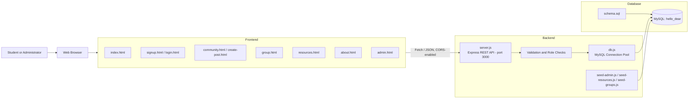

### Architectural Justification
This architecture was selected because it:
- keeps page presentation separate from database logic;
- allows several frontend pages to reuse the same backend API;
- enables persistent data storage instead of relying only on browser memory;
- makes debugging easier because each layer has a clear responsibility;
- supports future deployment of the frontend and backend separately; and
- allows new components, such as groups and group messages, to be added without rebuilding the original community pages.

---

## 5. Repository Component Structure
```text
CP3407.2026/
├── README.md
├── design.md
├── Iteration_1.md
├── Iteration_2.md
├── Iteration_3.md
├── index.html
├── about.html
├── signup.html
├── login.html
├── community.html
├── create-post.html
├── group.html
├── resources.html
├── admin.html
│
├── backend/
│   ├── server.js
│   ├── db.js
│   ├── migrate.js
│   ├── package.json
│   ├── package-lock.json
│   ├── env.example
│   ├── README.md
│   ├── seed-admin.js
│   ├── seed-resources.js
│   ├── seed-groups.js
│   └── db/
│       └── schema.sql
│
├── test/
│   ├── test.js
│   ├── unit.test.js
│   └── test.md
│
└── .github/
    └── ISSUE_TEMPLATE/bug_report.md
```

---

# 6. Major Component Design

## 6.1 Shared Navigation and Page Layout
### Files
- `index.html`, `about.html`, `community.html`, `resources.html`, `group.html`

### Responsibilities
The shared navigation component provides links to Home, Community, Resources, About Us, Log in, and Sign up. After a user logs in, the navigation displays the user's anonymous nickname and a **Log out** action.

The visible login state uses:
```text
hd_userId
hd_userEmail
hd_userNickname
```
The email is used to determine whether a user is logged in, while the nickname is used for public display. The password must not be stored in browser local storage.

### Design Decision
The navigation uses the same height, spacing, button styles, and responsive behaviour across the major pages. This gives users a consistent experience when moving through the platform.

---

## 6.2 Home Component
### File
`index.html`

### Responsibilities
Introduces the platform, explains major features, provides calls to action for account creation and community access, and guides users to other areas of the site.

### Design Decision
Feature cards and clear call-to-action buttons allow new users to understand the platform without reading technical documentation.

---

## 6.3 Account Registration Component
### File
`signup.html`

### Responsibilities
Collects an anonymous display nickname, university email, password, password confirmation, and agreement to Terms of Use / Privacy Policy.

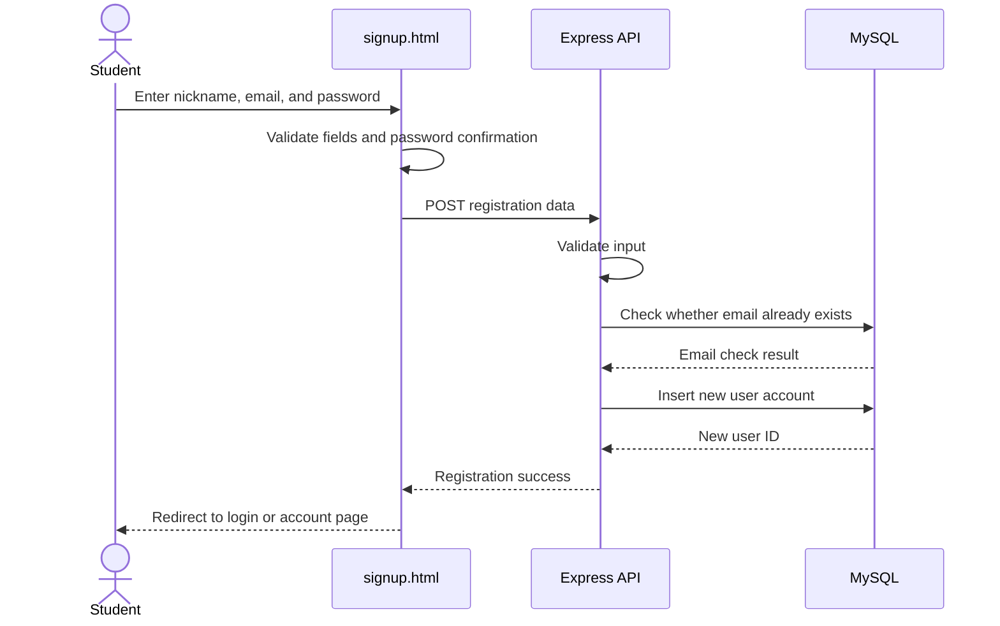

### Design Decisions
- The public nickname is separated from the private email.
- Duplicate email addresses are rejected (`users.email` is `UNIQUE`).
- Passwords are stored as bcrypt hashes (`password_hash`), not plain text.
- Terms and privacy information are available without leaving the registration form.

---

## 6.4 Authentication Component
### Files
`login.html`, `server.js`, `seed-admin.js`

### Responsibilities
Supports normal user login, administrator login, invalid-credential messages, login-state persistence, logout, and role-based access to the admin dashboard.

### Confirmed Implementation
- **User login** (`POST /api/login`): validates credentials against `users`, then returns `{id, email, nickname}` as JSON. **No server-side session or token is issued** — the client is responsible for storing this response and re-sending it on later pages. There is currently no server-side check that a "logged-in" request is genuine.
- **Admin login** (`POST /api/admin/login`): validates against `admins`, then issues a custom token signed with HMAC-SHA256 (Node `crypto`, not a third-party JWT library), valid for 8 hours. Admin routes are protected by a `requireAdmin` middleware that checks the `Authorization: Bearer <token>` header using a timing-safe comparison.

### Design Decision
Normal users and administrators have different responsibilities and different authentication mechanisms. Role validation for admin routes happens on the server via `requireAdmin`, not only by hiding the Admin link in the browser.

---

## 6.5 Community Post Component
### Files
`community.html`, `create-post.html`

### Responsibilities
Browse anonymous posts, search/filter, create a new post, comment, mark helpful responses, and report inappropriate content.

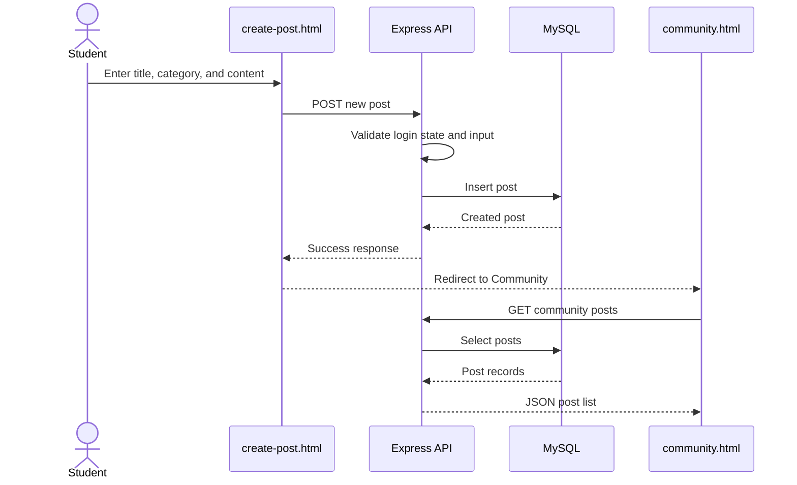

### Design Decisions
- Public posts display an anonymous nickname rather than an email.
- Search/category filters operate without changing the overall page layout.
- Post creation is a separate page to keep Community focused on browsing/interaction.
- Reporting is a safety mechanism rather than an automatic deletion action.

---

## 6.6 Group and Group Chat Component
### File
`group.html`

### Responsibilities
Browse existing support groups, search/filter, create a group within an approved category, enter a group chat, display the user's nickname, send messages, and reload recent messages.

### Approved Categories
The frontend offers four categories — Academic, Friendship, Mental Health, Another — as a fixed `<select>` list in `group.html`, and rejects client-side any value not in that list before submitting.

**Note on backend enforcement:** the restriction is currently enforced only at the UI layer. `POST /api/groups` on the backend will auto-create a new `group_categories` row for any `categorySlug` it doesn't recognise, rather than rejecting it — confirmed by an automated test (`TC-26` in `test/test.md`) that successfully created a group under a brand-new, never-seeded category slug via a direct API call. In practice a student using `group.html` can only ever submit one of the four approved slugs, so this is not exploitable through the normal UI — but it means the "fixed lookup table" description below is a description of the *frontend's* behaviour, not a guarantee the API itself makes. Whether to tighten `POST /api/groups` to reject unknown slugs, or to intentionally treat this as an extension point, is an open decision for the team (see `README.md` → Known Limitations).

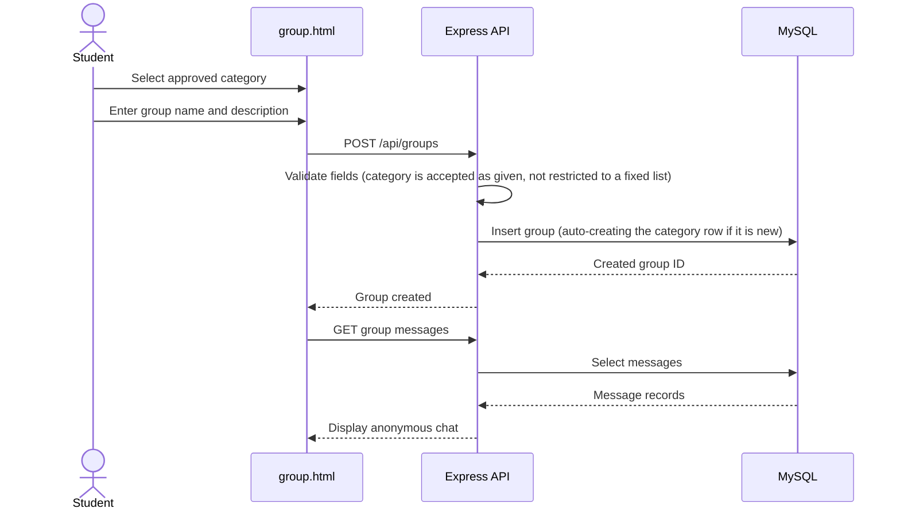

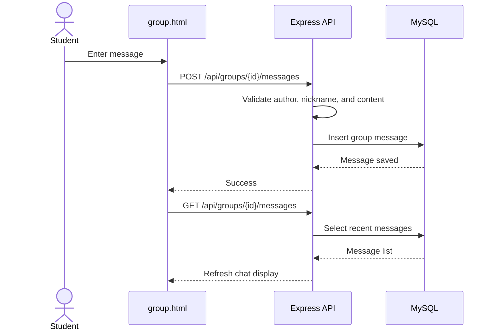

### Design Decisions
- The frontend restricts group creation to four categories, keeping the browse/filter experience simple and reducing inappropriate or duplicate category names in normal use (see the API-enforcement note above).
- The anonymous nickname is reused from the authenticated user state.
- `group_messages.author_id` is nullable so seeded "starter" messages can exist without a real account.
- The current implementation can poll the server for new messages; a future version could use WebSockets.

---

## 6.7 Resource Directory Component
### File
`resources.html`

### Responsibilities
Requests support resources from the backend, displays resource cards, supports search/category filtering, and presents contact/location information.

```text
resources.html → GET /api/resources → server.js → db.js → MySQL `resources` table
```

### Design Decisions
- Resources are stored in the database so they can be updated without redesigning the page.
- `seed-resources.js` provides initial resource records.
- University contact information must be verified before public deployment.

---

## 6.8 Feedback Component
### File
`about.html`

### Responsibilities
Allows a user to submit a suggestion, receive a success/error message, and store it for admin review.

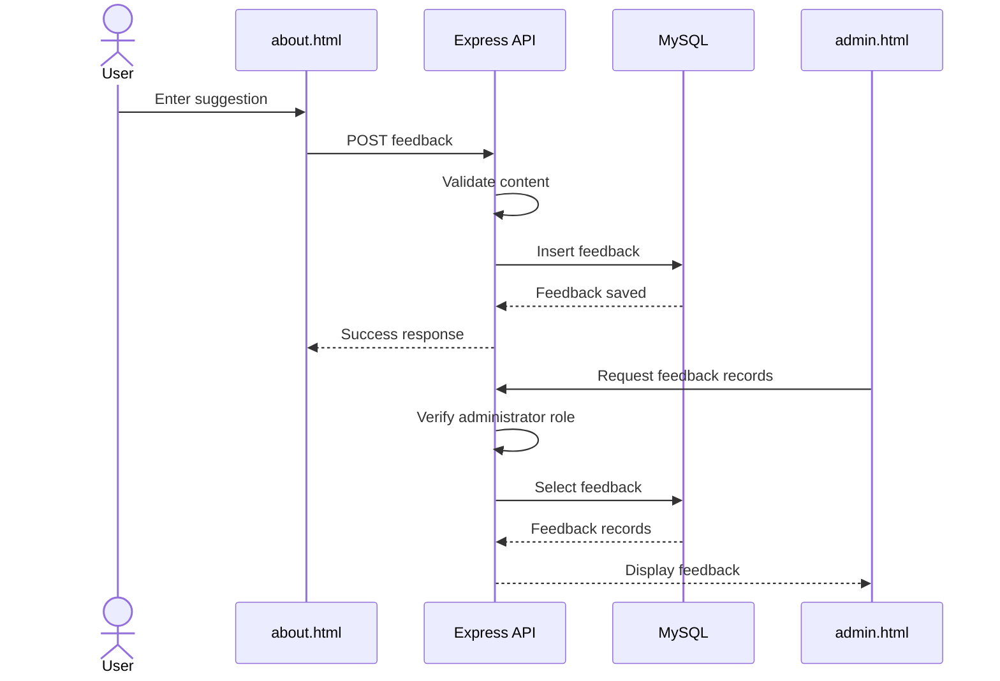

### Design Decision
Feedback is stored in the database instead of only the browser console, so the admin dashboard can use it as evidence for future improvements.

---

## 6.9 Administrator Dashboard Component
### File
`admin.html`

### Responsibilities
Authenticates an administrator, prevents normal users from accessing admin functions, displays feedback, reviews reports, and supports moderation decisions.

### Design Decisions
- Admin functions are visually and logically separated from student functions.
- Protected API routes check the admin token server-side (`requireAdmin`), so directly opening `admin.html` is not sufficient to access protected data.
- Seeded administrator data (`seed-admin.js`) supports repeatable demonstrations and testing.

---

## 6.10 Backend API Component
### Files
`backend/server.js`, `backend/db.js`, `backend/package.json`, `backend/env.example`

### `server.js`
Starts the Express app, accepts JSON requests, defines API routes, validates request data, connects frontend requests to database operations, returns responses, and enforces admin authentication via `requireAdmin`.

### `db.js`
Centralises the MySQL connection pool configuration (host, port, user, password, database read from environment variables; max 10 connections). Other backend logic should use this shared module instead of opening a new connection per route.

### Design Decision
Centralising connection code improves maintainability. Environment variables prevent database credentials from being committed to GitHub.

---

# 7. Database Design

## 7.1 Final ER Diagram
The diagram below was generated directly from the live MySQL database using **MySQL Workbench → Database → Reverse Engineer**, and reflects the actual, current `hello_dear` schema (12 tables).


**Figure 1. Final Hello Dear database ER diagram (MySQL Workbench, reverse-engineered from the live database).**

| Table | Main Fields | Purpose |
|---|---|---|
| `users` | `id`, `email`, `password_hash`, `nickname`, `status`, `created_at` | Registered student accounts and anonymous nicknames |
| `admins` | `id`, `admin_id`, `password_hash`, `created_at` | Administrator login records |
| `posts` | `id`, `author_id`, `title`, `category`, `content`, `is_public`, `created_at` | Anonymous community posts |
| `comments` | `id`, `post_id`, `author_id`, `content`, `created_at` | Comments written under posts |
| `post_likes` | `post_id`, `liker_id`, `created_at` | Records "helpful" votes/likes on posts |
| `reports` | `id`, `post_id`, `reporter_id`, `reason`, `status`, `created_at` | Reports submitted about posts |
| `feedback` | `id`, `author_id`, `content`, `status`, `created_at` | Suggestions submitted through the feedback form |
| `resources` | `id`, `category`, `title`, `description`, `contact_email`, `location`, `created_at` | Support resources shown on the Resources page |
| `settings` | `setting_key`, `setting_value` | Global platform configuration toggles |
| `group_categories` | `id`, `slug`, `label`, `created_at` | Fixed set of approved group categories |
| `groups_table` | `id`, `category_id`, `name`, `description`, `icon`, `created_at` | Anonymous support groups (chat rooms) |
| `group_messages` | `id`, `group_id`, `author_id`, `nickname`, `content`, `created_at` | Messages posted inside a group chat |

## 7.2 Relationships
| Parent Table | Child Table | Foreign Key | Relationship |
|---|---|---|---|
| `users` | `posts` | `posts.author_id` | One user can create many posts |
| `users` | `comments` | `comments.author_id` | One user can write many comments |
| `posts` | `comments` | `comments.post_id` | One post can contain many comments |
| `posts` | `post_likes` | `post_likes.post_id` | One post can receive many likes |
| `users` | `reports` | `reports.reporter_id` | One user can submit many reports |
| `posts` | `reports` | `reports.post_id` | One post can receive many reports |
| `users` | `feedback` | `feedback.author_id` | One user can submit many feedback records |
| `group_categories` | `groups_table` | `groups_table.category_id` | One category can contain many groups |
| `groups_table` | `group_messages` | `group_messages.group_id` | One group can contain many messages |
| `users` | `group_messages` | `group_messages.author_id` | One user can send many group messages (nullable, for seeded starter messages) |

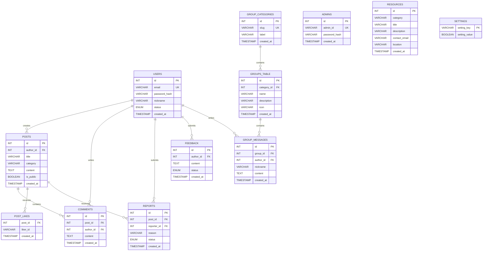

## 7.3 How `post_likes` Reaches the Live Database

`backend/db/schema.sql` now includes the group tables (`group_categories`, `groups_table`, `group_messages`) directly. One table is still added separately: **`post_likes`** (the "helpful" vote feature), created by **`backend/migrate.js`**, run once via `npm run migrate` (see `README.md` → "How to Run"). `migrate.js` re-creates the group tables too if they're somehow missing (e.g. a database created before `group.html` existed), but that's now a safety net, not the primary way they're created — `schema.sql` is.

This means `schema.sql` alone is **not yet** a complete description of the live database — `schema.sql` + `migrate.js`'s `post_likes` step together are. The ER diagram in §7.1 was reverse-engineered from the live database (i.e. after `migrate.js` had already run), which is why it correctly shows `post_likes` even though `schema.sql` on its own does not.

**Recommended follow-up (not urgent, but worth doing before final hand-off):** fold the `post_likes` `CREATE TABLE` statement into `schema.sql` too, so a single file is once again the full source of truth.

## 7.4 Database Design Justification
MySQL was selected because:
- the project contains structured and related data;
- users, posts, comments, reports, groups, and messages require clear relationships;
- foreign keys preserve referential integrity;
- SQL supports searching, filtering, sorting, and administrator queries;
- persistent storage ensures data remains after the browser or server restarts;
- password hashes can be stored without exposing the original password; and
- the schema can be demonstrated live using MySQL Workbench.

`backend/db/schema.sql` (once synced per §7.3) is the source of truth. The ER diagram, GitHub design page, backend queries, and screenshots must all use the same table and field names.

---

# 8. User Interface Design

## 8.1 Visual Identity
| Design Element | Choice | Reason |
|---|---|---|
| Primary colour | Purple | Creates a calm and recognisable identity |
| Background | Light grey and white | Improves readability and reduces visual overload |
| Cards | Rounded cards with subtle shadows | Separates information without making the interface feel harsh |
| Typography | Clear sans-serif font | Supports readability across desktop and mobile |
| Icons | Simple symbolic icons | Makes features easier to scan |
| Buttons | Primary and outline styles | Distinguishes main actions from secondary actions |
| Feedback | Inline messages, empty states, and dialogs | Explains results without requiring technical knowledge |

## 8.2 Responsive Design
Flexible containers, CSS Grid, Flexbox, responsive breakpoints, a mobile navigation menu, cards that collapse to a single column, and resizable forms.

## 8.3 Consistency
The same design system is reused across navigation bars, forms, community cards, resource cards, group panels, modal windows, alerts, and footer sections.

## 8.4 Accessibility Considerations
Semantic headings, labelled form fields, keyboard-focus states, accessible button labels, meaningful empty states, sufficient visual separation, responsive text/layouts, and keyboard interaction where implemented.

---

# 9. Privacy and Security Design

## Privacy Controls
- Public content displays the anonymous nickname.
- University email is not displayed on posts or messages.
- Real names are not required for public interaction.
- Group messages use the current Hello Dear nickname.
- Feedback and moderation information are restricted to authorised administrators.

## Security Controls — Current State
| Control | Status |
|---|---|
| Password hashing (bcrypt) | ✅ Implemented |
| Parameterised SQL queries | ✅ Implemented|
| Admin route protection | ✅ Implemented (`requireAdmin` + HMAC token) |
| **User-facing route protection (posts/comments/reports)** | ⚠️ **Client-side identity only.** The frontend sends a stored `authorId`/`userId` with each request; the server trusts it as-is. There is no server-side session or token proving the request actually came from that account (see §6.4). Anyone who knows or guesses another user's ID could act as them — create posts, comment, like, view their private posts, send group messages, or file reports in their name. This is the single biggest security gap in the current implementation. |
| **CORS restriction** | ⚠️ **Partially implemented.** `server.js` rejects requests from any browser origin *not* on the `FRONTEND_ORIGIN` allow-list — so it is not "allow all". However, it also unconditionally allows requests with **no Origin header at all** (e.g. `curl`/Postman/server-to-server calls) *and* requests with a `null` origin (pages opened via `file://`, which is how the static frontend is normally opened in this project). In practice this means the restriction only stops *other websites'* browser-based requests; it does not stop a direct API call from outside a browser. |
| Admin token secret | ✅ Implemented, but falls back to an insecure default if `ADMIN_TOKEN_SECRET` is unset — see `backend/env.example` |
| Duplicate email checks | ✅ Implemented (`users.email UNIQUE`) |
| Environment variables for credentials | ✅ Implemented (`dotenv`) |

These gaps should be disclosed here rather than omitted, and addressed where time allows (see §14 Limitations and §15 Future Improvements).

---

# 10. Design Patterns and Principles

## 10.1 Separation of Concerns
HTML defines content; CSS defines presentation; browser JavaScript controls interaction; Express controls routes/application logic; `db.js` controls database connectivity; MySQL controls persistent data.

## 10.2 Single Responsibility
| Page | Main Responsibility |
|---|---|
| `index.html` | Introduce the platform |
| `about.html` | Explain the project and collect feedback |
| `signup.html` | Register a student account |
| `login.html` | Authenticate users and administrators |
| `community.html` | Browse and interact with posts |
| `create-post.html` | Create an anonymous post |
| `group.html` | Create groups and participate in group chats |
| `resources.html` | Browse support services |
| `admin.html` | Support administration and moderation |

## 10.3 Reuse and Consistency
Reusable CSS classes and shared login-state behaviour reduce duplication and help keep the user experience consistent.

## 10.4 Controlled Extensibility
The system can be extended with new routes, tables, resources, administrator tools, and real-time group communication without replacing the existing navigation or page structure.

---

# 11. User Story Traceability
| User Story / Feature | Main UI Component | Backend/Data Component |
|---|---|---|
| Browse Website | `index.html` | Static page content |
| Learn About the Platform | `about.html` | Static content and feedback API |
| Create an Account | `signup.html` | `POST /api/signup` and `users` table |
| Log In | `login.html` | `POST /api/login` and `users` table |
| Browse Community Posts | `community.html` | Post retrieval route and `posts` table |
| Create an Anonymous Post | `create-post.html` | Post creation route and `posts` table |
| Comment on Posts | `community.html` | Comment route and `comments` table |
| Helpful Votes | `community.html` | Like route and `post_likes` table |
| Report Content | `community.html` | Report route and `reports` table |
| Browse Resources | `resources.html` | `GET /api/resources` and `resources` table |
| Create a Support Group | `group.html` | `POST /api/groups` and `groups_table` |
| Group Chat | `group.html` | Group-message routes and `group_messages` table |
| Submit Feedback | `about.html` | Feedback route and `feedback` table |
| Administrator Login | `login.html` | `POST /api/admin/login`, custom token |
| Administrator Dashboard | `admin.html` | `requireAdmin`-protected routes |

---

# 12. Required Design Evidence
Final files, in `assets/design/`:
```text
assets/design/
├── system-architecture.png
├── database-erd.png
├── homepage-prototype.png
└── prototype.png
```
(This list was originally six files, one per major page; `prototype.png` covers the login, community, groups, and admin-dashboard screens together in one combined image, so the list above reflects what's actually in the repository.)

## System Architecture

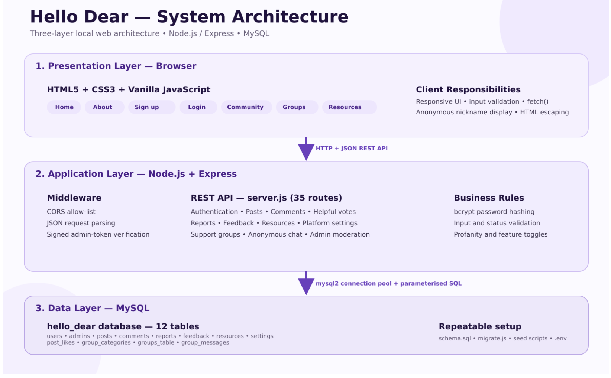

## Database ERD

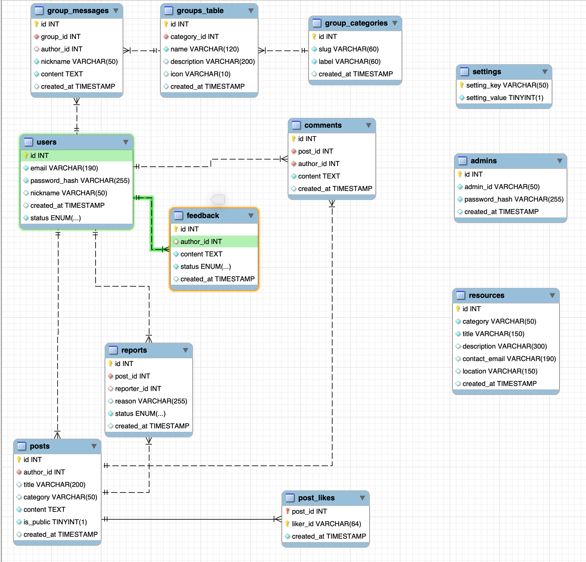

## UI Prototype

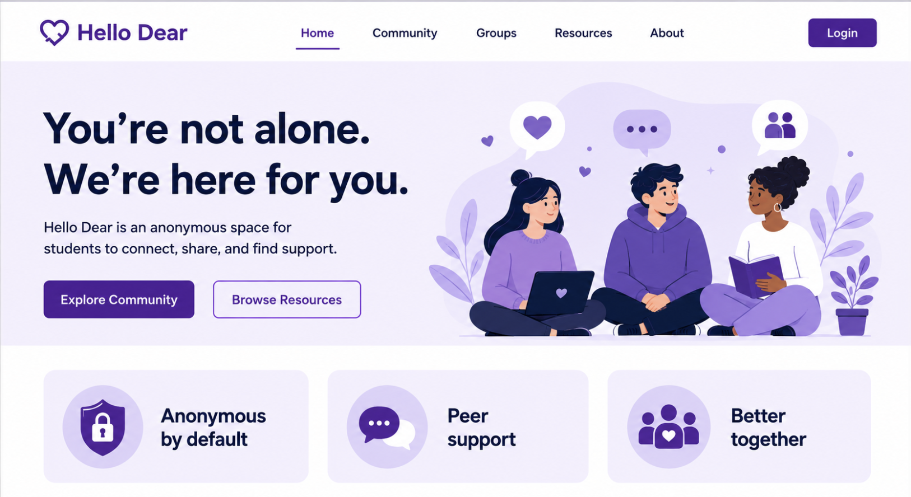

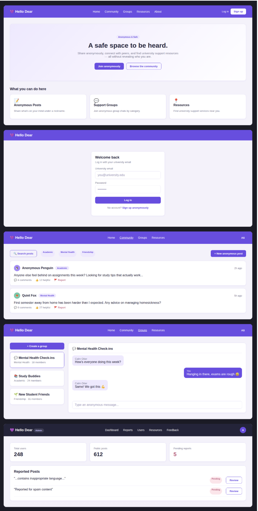

**Tools used:** `[TODO — team to fill in: name the actual tool(s) used to produce the architecture diagram, ERD, and prototype screens above — e.g. Figma, Canva, Keynote/PowerPoint, Excalidraw, an AI design tool, or hand-coded HTML/CSS. Do not list draw.io/Gliffy/Lucidchart/NinjaMock/Adobe XD below unless one of those was actually used — the image files themselves are screenshots (their EXIF metadata is tagged "Screenshot" by macOS), which only shows how they were captured, not which app was open when they were captured.]`

**Note on a difference between this prototype and the delivered site:** the prototype above shows "Groups" as a fifth top-level item in the main navigation bar. After building and reviewing the prototype, the team decided to keep Groups as a feature reached *from* the Community page (via its "+ Group" button) rather than a sibling top-level nav item in the delivered site — see `README.md` → Implementation / Delivered Solution → Demonstration Evidence for the reasoning. The prototype is left as originally designed rather than edited to match, since it documents the design's evolution rather than only the final state.

### Evidence Status
| Item | Status |
|---|---|
| Architecture diagram (`system-architecture.png`) | ✅ Done — `assets/design/system-architecture.png` |
| Database ERD (`database-erd.png`) | ✅ Done — `assets/design/database-erd.png`, and also embedded in §7.1 above |
| Interface prototype | ✅ Done — `assets/design/homepage-prototype.png` (homepage) and `assets/design/prototype.png` (login, community, groups, and admin-dashboard screens, combined in one file) |
| Deployed solution link | ❌ **Not done.** No deployment currently exists; see `README.md` → Implementation / Delivered Solution, where this is correctly marked as a local-demo decision rather than a deployment. |

Do not leave placeholders in the final submitted version.

---

# 13. Key Design Decisions and Justification
| Decision | Justification |
|---|---|
| Use anonymous nicknames publicly | Supports privacy and lowers the barrier to seeking peer support |
| Use university email for account access | Provides a practical private account identifier |
| Separate registration and login pages | Keeps each form focused and easier to validate |
| Separate create-post page | Prevents the Community page from becoming visually overloaded |
| Use fixed group categories | Prevents duplicate, unclear, or inappropriate user-created categories |
| Allow users to create groups | Supports specific peer-support needs within controlled categories |
| Use a relational database | Supports linked users, posts, comments, groups, and messages |
| Use REST APIs | Provides a clear interface between browser pages and the backend |
| Separate administrator access | Reduces accidental exposure of moderation functions |
| Reuse navigation and visual styles | Improves consistency and reduces duplicated code |
| Store resources in MySQL | Allows support information to be updated without redesigning the page |
| Keep secrets in environment variables | Prevents database credentials from being committed to GitHub |

---

# 14. Current Limitations
- No server-side session/token validation for normal user requests — see §6.4 and the "User-facing route protection" row in §9.
- CORS rejects unlisted browser origins, but allows any request with no Origin header or a `null` origin (see the "CORS restriction" row in §9) — not a full restriction.
- `backend/db/schema.sql` includes the group tables directly, but `post_likes` is still added separately by `backend/migrate.js` (see §7.3) — `schema.sql` + `migrate.js` together, not `schema.sql` alone, are the full source of truth.
- The four group categories (Academic, Friendship, Mental Health, Another) are enforced by the frontend's dropdown and by client-side validation, but not by the API itself — see §6.6.
- Group chat may use periodic polling rather than WebSockets.
- University resource information must be verified before deployment.
- Advanced content moderation is limited.
- The final deployment architecture may differ from local development.
- Accessibility should be tested with real assistive technologies.

---

# 15. Future Design Improvements
- Add real session/token-based authentication for normal users.
- Close the CORS gap: stop accepting no-origin/null-origin requests once the frontend is served over HTTP instead of opened via file://.
- WebSocket-based real-time group chat.
- Email verification.
- Administrator resource-management forms.
- Group membership controls.
- Message reporting and moderation.
- Multilingual support, notifications, accessibility testing, cloud deployment, automated backup, audit logs for administrator actions.

---

# 16. Conclusion
The Hello Dear design separates the interface, backend, and database into clear major components. The architecture supports anonymous student interaction, persistent data, controlled group creation, resource discovery, feedback, and administration.

The design is appropriate for the project scope because it is understandable, modular, maintainable, suitable for iterative development, connected to the project user stories, and capable of future extension without replacing the complete system.
