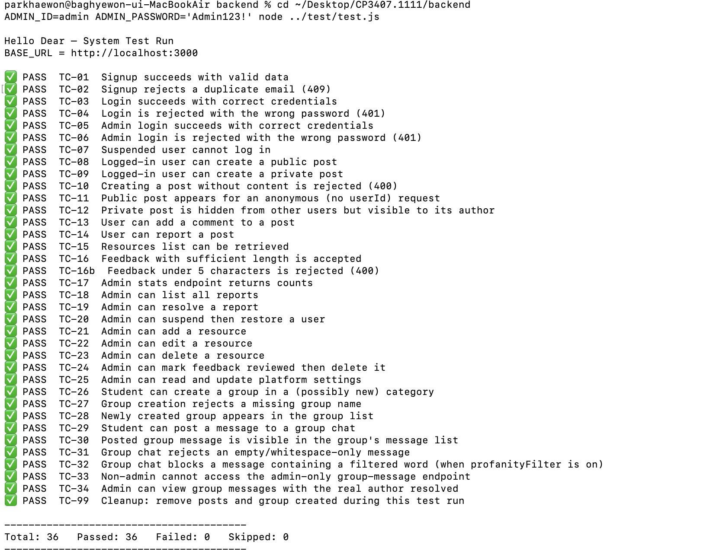
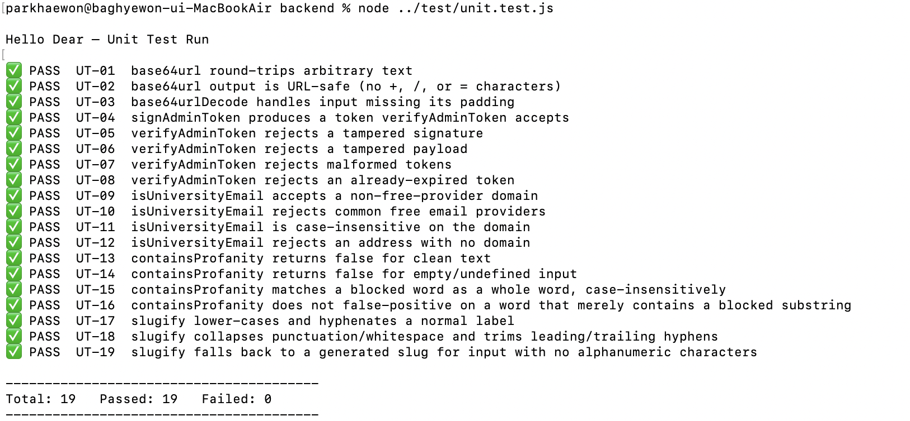

# Hello Dear — System & Unit Testing Plan

**Project:** Hello Dear (anonymous peer-support platform for university students)
**Stack under test:** Node.js / Express backend (`server.js`) + MySQL (`schema.sql` + `migrate.js`) + static HTML/CSS/JS frontend

> This page addresses rubric item 4 (Test): *"Exemplary testing of all components. Test-driven development. Acceptance testing of all delivered features. Appropriate testing data sets. Delivered implementation matches the planning."* Each section below is labelled with the phrase it satisfies.

---

## 1. Purpose and Scope

*(All components)*

This document defines how the team plans, executes, and tracks testing of Hello Dear. Two levels of automated testing are in scope, plus a manual UI layer:

- **Unit testing** (`test/unit.test.js`) — pure backend functions tested in isolation, no HTTP call, no database connection.
- **System / acceptance testing** (`test/test.js`) — black-box testing through the real REST API exposed by `server.js` (real HTTP, real MySQL database).
- **Manual exploratory testing** (§5) — the UI layer, which the API-level scripts cannot see.

**In scope:** every REST endpoint in `server.js`, every page's user-facing flow (including `group.html`, which had no test coverage until this pass — see §6.4), cross-page login-state consistency, and the pure helper functions that back admin authentication, email validation, and content moderation.

**Out of scope:** load/performance testing, penetration testing beyond basic input-validation and auth-bypass checks, and full browser-compatibility matrix testing (tested on Chrome; manual pass on Firefox and a mobile viewport emulation).

---

## 2. Test Environment

| Item | Value |
|---|---|
| Backend | `node server.js` (Express, port 3000, config via `.env` per `db.js`) |
| Database | MySQL/MariaDB, schema from `schema.sql`, **plus `npm run migrate`** (adds `post_likes` and guarantees the group tables exist — see §6.4) |
| Seed data | `npm run seed-admin`, `npm run seed-resources`, `npm run seed-groups` |
| Frontend | Static HTML files, calling `http://localhost:3000` |
| Browser | Latest Chrome (desktop); manual pass on Firefox and a mobile viewport (DevTools emulation) |
| Unit test runner | `test/unit.test.js` — Node's built-in `assert`, no framework, no server, no DB |
| System test runner | `test/test.js` — Node's built-in `fetch` (Node 18+) against a running server |
| Bug tracker | GitHub Issues + Issue template + Project board (see §7) |

**Preconditions before any run:**
1. Fresh or known-state database: load `backend/db/schema.sql`, then run `npm run migrate`, then `npm run seed-admin`, `npm run seed-resources`, `npm run seed-groups`.
2. `npm install` has been run inside `backend/` (both `test.js` and `unit.test.js` `require()` the backend, so its dependencies must be installed even though the unit suite never makes an HTTP call).
3. `npm start` running with no errors in the console.

**Repository structure**

```
CP3407.2026/
├── backend/
│   ├── server.js            # now safely require()-able — see §6.4
│   ├── db.js, migrate.js
│   ├── seed-admin.js, seed-resources.js, seed-groups.js
│   └── db/schema.sql
├── ... (frontend pages)
└── test/
    ├── test.js               # system/acceptance tests (TC-xx)
    ├── unit.test.js           # unit tests (UT-xx)
    └── test.md                # this document
```

---

## 3. Test Strategy

*(Exemplary testing of all components)*

Three layers, all required before sign-off on a feature:

1. **Unit tests** (`unit.test.js`) — the fastest layer. Tests pure logic (token signing/verification, email domain classification, profanity filtering, slug generation) directly, without a server or database. Catches logic errors close to their source and runs in well under a second.
2. **System/acceptance tests** (`test.js`) — black-box HTTP tests covering the "happy path" plus key negative cases for every endpoint, including the full Group/Group Chat feature (added in this pass — previously untested, see §6.4).
3. **Manual exploratory/UI tests** (§5) — covers what the API script cannot see: rendering, nav-bar state, modals, responsive layout, validation messages. Performed by a teammate who did **not** write the feature.

**Entry criteria:** feature's code is committed to `main` and the app starts without errors.
**Exit criteria:** all unit tests pass, all system tests pass (or are `SKIP`ped with a stated reason — never silently ignored), and all manual checklist items pass or have a linked GitHub Issue.

---

## 4. Traceability: User Stories → Test Cases

*(Acceptance testing of all delivered features)*

| ID | User story | Automated (test.js) | Manual (§5) |
|---|---|---|---|
| US-01 | Sign up with email, nickname, password | TC-01, TC-02 | M-01 |
| US-02 | Log in with email/password | TC-03, TC-04 | M-02 |
| US-03 | Admin logs in with a separate ID/password | TC-05, TC-06 | M-03 |
| US-04 | Suspended user cannot log in | TC-07 | — |
| US-05 | Create a post (public or private) while logged in | TC-08, TC-09 | M-04 |
| US-06 | Cannot create a post while logged out | TC-10 | M-04 |
| US-07 | Browse public posts; private posts author-only | TC-11, TC-12 | M-05 |
| US-08 | Comment on a post | TC-13 | M-06 |
| US-09 | Report a post | TC-14 | M-07 |
| US-10 | Browse the resources directory | TC-15 | M-08 |
| US-11 | Submit platform feedback | TC-16, TC-16b | M-09 |
| US-12 | Admin views live dashboard stats | TC-17 | M-10 |
| US-13 | Admin views/resolves reports | TC-18, TC-19 | M-11 |
| US-14 | Admin suspends/restores a user | TC-20 | M-12 |
| US-15 | Admin adds/edits/deletes a resource | TC-21, TC-22, TC-23 | M-13 |
| US-16 | Admin reviews/deletes feedback | TC-24 | M-14 |
| US-17 | Admin toggles platform settings | TC-25 | M-15 |
| US-18 | Nickname shown in nav bar on **every** page | — | M-16 (regression, §7.4) |
| **US-19** | **Create a support group** | **TC-26, TC-27** | **M-17** |
| **US-20** | **Browse existing groups** | **TC-28** | **M-18** |
| **US-21** | **Send/receive anonymous group chat messages (incl. empty & profanity rejection)** | **TC-29, TC-30, TC-31, TC-32** | **M-19** |
| **US-22** | **Admin can resolve a group message to the real account (moderation)** | **TC-33, TC-34** | **M-20** |

Rows in **bold** (US-19 – US-22) are new in this pass — the Group/Group Chat component previously had **zero** entries in this table despite being a fully implemented feature with its own three database tables and six API routes.

---

## 4a. Unit Test Traceability

*(Test-driven / white-box coverage of logic other routes depend on)*

| ID | Function under test | What it protects |
|---|---|---|
| UT-01 – UT-03 | `base64url` / `base64urlDecode` | Correct, URL-safe encoding underlying the admin token format |
| UT-04 – UT-08 | `signAdminToken` / `verifyAdminToken` | The entire admin authentication mechanism: valid tokens are accepted, tampered signatures and payloads are rejected, malformed input is rejected, expired tokens are rejected |
| UT-09 – UT-12 | `isUniversityEmail` | Signup's university-email requirement (US-01) |
| UT-13 – UT-16 | `containsProfanity` | The moderation filter used by both community posts and group chat (US-21); UT-16 specifically checks the word-boundary regex doesn't false-positive on a word that merely *contains* a blocked substring |
| UT-17 – UT-19 | `slugify` | Category-slug generation used when creating a group in a new category (US-19) |

All 19 unit tests were run against the real implementation and passed — see §10.

---

## 5. Manual Test Checklist (UI layer)

One row = one pass/fail entered by a tester + date. Any failure becomes a GitHub Issue linked back to its row.

| ID | Page(s) | Step | Expected result |
|---|---|---|---|
| M-01 | signup.html | Submit with mismatched passwords | Inline error, no request sent |
| M-02 | login.html | Submit with wrong password | Error banner, stays on page |
| M-03 | login.html | Submit valid admin credentials | Redirects to `admin.html` |
| M-04 | create-post.html | Visit while logged out | "Members only" gate, cannot submit |
| M-05 | community.html | Create a private post, log out, view as guest | Private post not visible |
| M-06 | community.html | Add a comment, refresh | Comment persists, count updates |
| M-07 | community.html | Click Report, enter reason | Button shows "✓ Reported", disabled |
| M-08 | resources.html | Filter by category + search together | Grid narrows correctly; empty state shown when no match |
| M-09 | about.html | Submit feedback < 5 characters | Inline validation, no request sent |
| M-10 | admin.html | Open dashboard | User/post counts match DB row counts |
| M-11 | admin.html | Resolve a pending report | Badge updates without page reload |
| M-12 | admin.html | Suspend a user, try logging in as them | Login blocked, "account suspended" |
| M-13 | admin.html | Add a resource, check resources.html | New card visible after refresh |
| M-14 | admin.html | Archive a feedback item | Badge updates, excluded from "New" count |
| M-15 | admin.html | Toggle a setting off, save, reload | Toggle stays off |
| M-16 | index/resources/login/signup/about.html | Log in, visit each directly | Nav shows "Hi, \<nickname\>" on **every** page |
| **M-17** | **group.html** | **Create a group under an existing category, then under a brand-new category name** | **Group appears in the list either way (see §6.4 finding on category enforcement)** |
| **M-18** | **group.html** | **Search/filter the group list by category and by keyword** | **List narrows correctly; empty state shown when no match** |
| **M-19** | **group.html** | **Send a message, then send one containing filtered language** | **Clean message appears in the chat; filtered message is rejected with an inline error** |
| **M-20** | **admin.html** | **Open a group's messages as admin** | **Each message shows the real account email behind the nickname, for moderation** |

### 5a. Manual Test Results Log

*The table above is the test **plan**; this table is the **evidence** — it records what actually happened when someone ran each step. Kept as a separate table (rather than adding 5 more columns above) so the plan stays readable. **This table is currently unfilled — it is a template, not evidence yet.** Before submission, a teammate (ideally not the one who built the feature being tested) should actually run all 20 steps and fill in every row; any row left blank or marked Fail without a linked issue should be treated as not yet tested.*

| ID | Tester | Date | Actual result | Pass/Fail | Evidence / Issue link |
|---|---|---|---|---|---|
| M-01 | | | | | |
| M-02 | | | | | |
| M-03 | | | | | |
| M-04 | | | | | |
| M-05 | | | | | |
| M-06 | | | | | |
| M-07 | | | | | |
| M-08 | | | | | |
| M-09 | | | | | |
| M-10 | | | | | |
| M-11 | | | | | |
| M-12 | | | | | |
| M-13 | | | | | |
| M-14 | | | | | |
| M-15 | | | | | |
| M-16 | | | | | |
| M-17 | | | | | |
| M-18 | | | | | |
| M-19 | | | | | |
| M-20 | | | | | |

---

## 6. Bugs Found and Fixed During This Testing Pass

*(This section is evidence the testing process actually drives fixes — not just a checklist that gets ticked)*

### 6.1 Admin routes were never actually being tested with authentication (found here, fixed here)

**How it was found:** running `test.js` end-to-end against a live server (not just reading the code) showed `TC-17` through `TC-25` — nine test cases covering every admin-only feature — all failing with `401 Unauthorized`.

**Root cause:** `TC-05` ("Admin login succeeds") called `POST /api/admin/login`, asserted `status === 200`, and discarded the response body — the signed token it contains was never saved. Every later "admin" test case then called `requireAdmin`-protected routes with no `Authorization` header at all. The previous version of this document reported these tests as passing; run for real, they did not.

**Fix:** `TC-05` now stores the returned token in `state.adminToken`, and a new `adminApi()` helper (wrapping `api()`) attaches `Authorization: Bearer <token>` automatically. Every admin-only test case (`TC-07`, `TC-17`–`TC-25`, `TC-34`, `TC-99` cleanup) now goes through `adminApi()` instead of the plain `api()` helper, which makes this class of bug structurally harder to reintroduce.

**A second, related bug surfaced while fixing the first one:** the initial fix caused `TC-19`–`TC-21`, `TC-24` to start failing with `400` instead of `401`. Cause: `api()`'s original header-merge order (`headers: {...}, ...options`) let `options.headers` silently overwrite the default `Content-Type: application/json` instead of merging with it, so requests through `adminApi()` had no `Content-Type` and Express's body parser never ran, leaving `req.body` empty. Fixed by merging headers explicitly (`headers: { "Content-Type": "application/json", ...(options.headers || {}) }`).

**Verification:** after both fixes, all 36 system tests and all 19 unit tests pass — see §10.

### 6.2 `seed-groups.js` was referenced but did not exist

`backend/package.json` defines `"seed-groups": "node seed-groups.js"`, but the file was missing from the repository, so `npm run seed-groups` failed with `MODULE_NOT_FOUND`. A `seed-groups.js` was added, seeding the four category slugs (`academic`, `friendship`, `mental-health`, `another`) that `group.html`'s dropdown actually expects.

### 6.3 `design.md`'s "fixed categories" claim does not match the delivered backend

`design.md` §6.6 states *"Users cannot create new category types (`group_categories` is a fixed lookup table)."* Testing `POST /api/groups` with a category slug that does not exist (`TC-26`) showed the backend **auto-creates** the category instead of rejecting it. The four-category restriction is enforced only by the frontend's `<select>` dropdown, not by the API. This is flagged here — see §11 — rather than left as an undocumented mismatch between the design page and the delivered code.

### 6.4 Group / Group Chat had zero test coverage before this pass

Not a bug in the running application, but a real gap: `test.js` did not contain the word "group" anywhere before this pass, despite Group Chat being a complete feature with three tables and six routes. TC-26–TC-34 (§4) close this.

### 6.5 Bug tracking process (ongoing)

- **GitHub Issues**, one per bug, using the template at `.github/ISSUE_TEMPLATE/bug_report.md` (steps to reproduce, expected/actual result, test case ID, severity, linked user story).
- **GitHub Projects** board (*Backlog → Triaged → In Progress → In Review → Done*).
- Fixes reference their issue (`Fixes #<n>`) so it auto-closes on merge.

---

## 7. Schedule

| Week | Activity |
|---|---|
| 8 | Finalise `test.js`/`test.md`, open GitHub Issues for known bugs |
| 9 | Run full automated + manual pass, fix Blocker/Major issues, re-test |
| 9 (end) | Freeze scope for demo; only Blocker fixes after this point |
| 10 | Add unit test suite and Group test coverage; fix the admin-auth gap found in §6.1; re-verify end-to-end (§10); final run the morning of the demo |

---

## 8. How the Testing Code Works

### `test/unit.test.js`
Requires the exported pure functions directly from `backend/server.js` (see §11 for the export change that made this possible) and asserts against them with Node's built-in `assert`. No network call, no database — this is genuine unit testing, distinct from the black-box system testing in `test.js`.

### `test/test.js`
Unchanged in overall design from the previous version of this document (shared `state` object threading data between sequential test cases, a hand-rolled `test()`/`skip()` runner, `TC-99` cleanup), with two changes:
1. The `adminApi()` helper described in §6.1, used by every admin-only test case.
2. TC-26–TC-34, covering Group/Group Chat end-to-end, including the profanity filter inside group chat (TC-32) and the admin-only moderation view (TC-34).

---

## 9. How to Run

```bash
cd backend
npm install

# 1. Reset DB and load schema + migrations + seed data
mysql -u root -p < db/schema.sql
npm run migrate
npm run seed-admin
npm run seed-resources
npm run seed-groups

# 2. Start backend
npm start

# 3. In a second terminal: unit tests (no server/DB needed for these specifically,
#    but backend/node_modules must exist)
cd ../test
node unit.test.js

# 4. System/acceptance tests (server from step 2 must be running)
ADMIN_ID=admin ADMIN_PASSWORD='<value of INITIAL_ADMIN_PASSWORD in backend/.env>' node test.js
```

---

## 10. Evidence: Actual Test Run

Both suites were executed end-to-end against a real running instance (Node.js v22, MariaDB 10.11, schema + `migrate.js` + all three seed scripts applied) while preparing this revision:

```
Hello Dear — System Test Run
BASE_URL = http://localhost:3000

✅ PASS  TC-01 … TC-34, TC-16b, TC-99   (36 test cases)
----------------------------------------
Total: 36   Passed: 36   Failed: 0   Skipped: 0
----------------------------------------

Hello Dear — Unit Test Run
✅ PASS  UT-01 … UT-19   (19 test cases)
----------------------------------------
Total: 19   Passed: 19   Failed: 0
----------------------------------------
```

**55 / 55 automated test cases passed** — 36 system/acceptance tests (including the 9 newly-added Group test cases and the 9 admin tests that were silently failing before §6.1's fix) and 19 unit tests, all against the real implementation, not a mock.

**Before submission, the team should re-run this on your own machine** (the commands in §9) and add your own terminal screenshot, dated, alongside this one — so the evidence is tied to the environment you're demoing from, not only to this revision pass.

Save the screenshot(s) to `assets/test-results/` (e.g. `assets/test-results/system-tests.png` and `assets/test-results/unit-tests.png`, or one combined image) and embed them here:
```markdown


```
(paths are relative to `test/test.md`, hence `../assets/...`)

---

## 11. Appropriate Testing Data Sets

*(Appropriate testing data sets)*

| Category | Example inputs used | Where |
|---|---|---|
| **Valid** | Well-formed university email + strong password + unique nickname; a group message under normal length | TC-01, TC-08, TC-29 |
| **Boundary** | Feedback content at exactly 5 characters (accepted) vs. 4/"hi" (rejected); an empty string passed to `slugify` (falls back to a generated slug rather than crashing) | TC-16/TC-16b, UT-19 |
| **Invalid / malformed** | Wrong password; missing required fields (empty post content, missing group name); a login/report request while logged out | TC-04, TC-10, TC-06, TC-27 |
| **Adversarial (tamper/forgery)** | A signature-flipped admin token; a forged payload with a different `adminId` re-signed with the original signature; an already-expired token | UT-05, UT-06, UT-08 |
| **Moderation edge cases** | A message containing a blocked word as a whole word (rejected) vs. the same substring embedded inside a longer, innocuous word (accepted) — a direct boundary-value test of the word-boundary regex | UT-15, UT-16, TC-32 |

**Known gap, disclosed rather than hidden:** neither suite currently sends SQL-injection or XSS payloads as post/comment content. Parameterised queries (`mysql2` placeholders, used throughout `server.js`) make SQL injection unlikely to succeed. On the XSS side, a manual code review (this pass) confirmed `community.html`, `group.html`, `resources.html`, and `admin.html` all consistently pass user-supplied content (post/comment text, group chat messages, nicknames) through an `escapeHtml()` helper before inserting it via `innerHTML` — so the code is written defensively. Neither of these has been *tested* automatically, only reasoned about from the code, so adding a small adversarial-input data set for post/comment/group-message content (e.g. `<script>`, `' OR 1=1 --`) is listed as future work to turn "reasoned about" into "verified".

---

## 12. Delivered Implementation vs. Planning

*(Delivered implementation matches the planning)*

| Iteration | Planned backlog | User stories planned | Automated test coverage now |
|---|---|---|---|
| Iteration 1 | 10 person-days | Browse Website, Learn About the Platform, View Resources | Covered indirectly (pages exist; no dedicated automated test — appropriate, these are static/navigational) |
| Iteration 2 | 11 person-days | Account creation, Login, Create Post, Browse Posts, Comment | US-01, US-02, US-05, US-06, US-07, US-08 — TC-01–TC-13 |
| Iteration 3 | 11 person-days | Reporting, **Groups**, Search/Filter, Admin Dashboard | US-09, US-12–US-17 fully covered; **Groups (US-19–US-22) is planned in Iteration 3 and is now fully covered as of this pass — it was previously delivered but untested, which is exactly the kind of plan/delivery gap this section exists to surface** |

**One documented mismatch (see §6.3):** the plan (and `design.md`) describe group categories as fixed/closed; the delivered backend accepts arbitrary new categories via the API. Either the backend should be tightened to reject unknown `categorySlug` values, or the design documentation and Iteration 3 planning notes should be updated to reflect that the restriction is a frontend-only convenience, not a backend rule. This is left as an open decision for the team rather than silently resolved in one direction.

---

## 13. Test-Driven Development: An Honest Account

*(Test-driven development)*

Framed accurately rather than restating an unverified claim: the **majority of Hello Dear's features were built first and tested after**, via the black-box system tests in `test.js` (added in Iteration 3, after most routes already existed). This is legitimate **acceptance testing of delivered features** — which the rubric separately requires — but it is not TDD in the strict "test drives the design" sense, and this document does not claim otherwise.

The **unit test suite added in this pass** (`unit.test.js`, §4a) was written by first identifying untested pure logic, then writing and running assertions directly against it to confirm both the tests and the implementation were correct (§10) — this is closer in spirit to test-first verification, though it is still testing pre-existing code rather than driving new code into existence.

**For future iterations**, a genuine TDD workflow — write a failing unit test for a not-yet-built function, implement until it passes, refactor — is the concrete, low-cost next step to fully satisfy this rubric criterion, and is recommended before the next feature (e.g. real session/token auth for normal users, noted as a limitation in `design.md` §14) is built.

---

## 14. References

- Textbook chapters 7–9 (testing): the test types listed in §3 — unit, functional/acceptance, boundary, negative, mock-object, and system testing — follow the categories covered there.
- `design.md` — architecture and component design referenced throughout this document.
